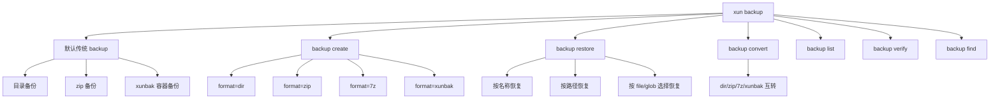
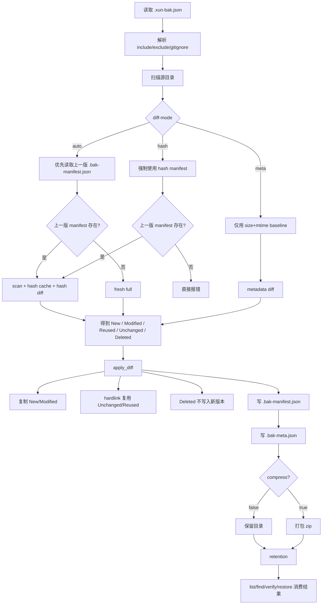
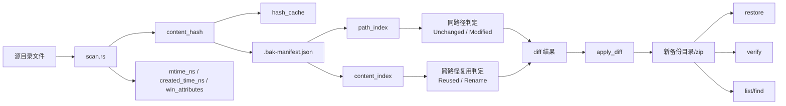
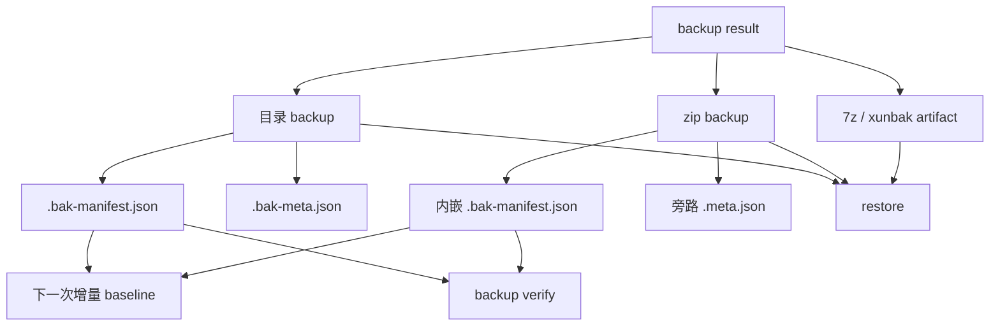

# Backup 概览 Mermaid 图

> 面向当前 XunYu 的 `backup / restore / convert / verify` 体系。
> 聚焦传统 `backup` 主链路，以及 `dir / zip / xunbak / 7z` 产物之间的关系。

---

## 1. 命令面

---

## 2. 传统 backup 主链路

---

## 3. 哈希增量数据关系

---

## 4. 备份结果与消费关系

---

## 5. 说明

1. 传统 `backup` 现在已经是 **hash 驱动增量**。
2. `diff-mode=auto|hash|meta` 控制增量判定方式。
3. `.bak-manifest.json` 是传统 backup 的权威快照元数据。
4. `hash_cache` 只是性能优化，不是真相来源。
5. `backup create / restore / convert` 统一负责多格式产物。
