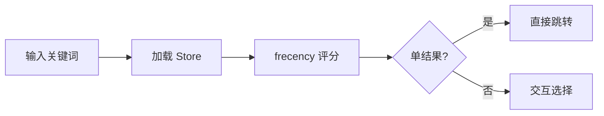

# 模块文档写作规范

> 本文约束 `docs/module/` 下所有模块文档的结构、语言与格式，确保文档风格统一、可维护，并满足"看懂 → 执行 → 定位代码"三个核心目标。

---

## Agent 执行指南

### 信息来源映射

| 文档章节 | 信息来源 |
|----------|----------|
| 概述 / 职责边界 | 模块 `commands.rs` 注释 + README |
| 前置条件 | `Cargo.toml` feature gate + 平台限制注释 |
| 快速入门 | 集成测试用例（`tests/`） |
| 命令详解 / 参数表格 | CLI 参数定义（`clap` 结构体） |
| 代码地图 | 模块目录结构（`src/<module>/`） |
| 实现细节 | 源码注释 + bench 结果 |
| 性能 | `benches/` 基准测试输出 |
| 测试 | `tests/` 目录 + CI 配置 |

### 执行步骤

1. 读取本规范（`00-writing-guide.md`），确认当前版本
2. 读取目标模块的源码目录结构（`src/<module>/`）
3. 按「文档结构」章节顺序逐节填写，每节完成后暂停自审
4. 对照「章节内容约束」检查每节格式是否符合规范
5. 完成全文后执行「自审清单」逐项核对

### 自审清单

- [ ] 文件命名符合两位数字前缀规则
- [ ] 所有必需章节均存在且有内容
- [ ] 语言与措辞表格中五项规则均已遵守
- [ ] 代码块均标注语言（`bash`/`mermaid`/`rust`）
- [ ] 每条子命令包含参数表格 + 至少 2 个用例 + 参数组合速查表
- [ ] 代码地图包含至少 3 行，路径相对于项目根目录
- [ ] 每个实现细节小节包含源代码位置
- [ ] 性能章节包含实测数据，无估算值
- [ ] 禁止事项中所有 MUST NOT 条目均未违反
- [ ] 交叉引用均使用相对路径

---

## 文件命名

| 规则 | 示例 |
|------|------|
| 两位数字前缀 + 模块名，小写，连字符分隔 | `01-ACL.md`、`03-batch_rename.md` |
| 数字按功能重要性或开发顺序排列 | 核心模块靠前 |
| 本规范文件固定为 `00-writing-guide.md` | — |

---

## 文档结构

每份模块文档必须按以下顺序组织章节，缺失章节须有明确理由：

```
# <模块名> 模块

> 一句话描述：命令入口 + 核心能力 + 子命令数量

---

## 概述
### 受众与阅读建议   ← 目标读者 + 推荐阅读路径（1-2 句）
### 职责边界         ← 表格：能力 | 说明
### 分层结构         ← 表格（如有多层架构）
### 前置条件         ← 平台、feature gate、权限、初始化步骤

---

## 快速入门
（3-5 步编号列表，可直接复制执行，含预期输出）

---

## 核心概念
### <概念1>   ← 每个核心概念独立小节
### <概念2>

---

## 命令总览
（命令树 mindmap 或表格）

---

## 命令详解
### <子命令>   ← 参数表格 + 多场景用例 + 预期输出 + 常见问题

---

## 代码地图
（模块代码索引表，固定格式）

## 实现细节
### <关键机制>   ← 描述行为 + 源代码位置

---

## 性能
（基准数据、优化记录）

---

## 测试
（测试套件说明、运行命令、如何本地验证文档示例）

---

## 变更记录
（版本历史，倒序）
```

---

## 语言与措辞

| 维度 | 规则 |
|------|------|
| 语言 | 中文正文，代码/命令/字段名保留英文原文 |
| 受众 | 面向熟悉 CLI 的开发者；首次出现专业术语时括号附英文原文 |
| 术语一致性 | 同一概念在全文使用同一中文译名 |
| 语气 | 陈述句为主，避免"应该"、"可以考虑"等模糊措辞；描述事实而非建议 |
| 长度 | 每个小节聚焦单一职责，避免在一节内混合多个概念 |

---

## 格式规范

### 标题

| 级别 | 用途 |
|------|------|
| `#` | 文档标题，格式固定为 `# <模块名> 模块` |
| `##` | 主章节（概述、核心概念、命令详解等） |
| `###` | 子章节（具体概念、单条命令） |
| `####` | 仅在命令参数分组时使用，不超过此深度 |

### 表格

- 所有能力/字段/参数说明优先用表格，不用纯文字列举
- 列宽对齐：`|------|------|`（两列）或 `|------|------|----------|`（三列）
- 表头加粗由 Markdown 渲染自动处理，无需手动加 `**`

### 代码块

- 命令示例统一使用 `bash` 语言标注（便于语法高亮和复制）
- 内联命令/字段名使用反引号：`` `bm z foo` ``、`` `visit_count` ``
- 文件路径使用反引号，Windows 路径用正斜杠：`` `%APPDATA%/xun/` ``
- 预期输出使用无语言标注的代码块

### Markdown 语法使用

仅允许以下语法子集，其余一律禁止：

| 元素 | 规则 |
|------|------|
| 标题 | 仅 ATX 风格（`#`/`##`/`###`/`####`），前后空一行 |
| 无序列表 | 统一用 `- `（减号 + 空格） |
| 有序列表 | 统一用 `1. ` |
| 代码块 | 必须标注语言（`bash`/`mermaid`/`rust`），禁止裸 ` ``` ` |
| 链接 | 内部文件用相对路径，禁止绝对路径或外部 URL 引用内部文件 |
| 强调 | 仅 `**粗体**`，禁止 `_斜体_` |
| 禁止 | HTML 标签、Setext 标题（`===`）、任务列表、脚注、自定义 class |

**正确示例**：

```markdown
### `bm save`

将当前目录保存为书签。

```bash
bm save myproject
```

**参数**：

| 参数 | 类型 | 默认值 | 说明 |
|------|------|--------|------|
| `name` | string | 当前目录名 | 书签名称 |
```

### 图表

- 命令树使用 `mermaid mindmap`
- 数据流/状态机使用 `mermaid flowchart LR`
- 不使用图表时，用表格替代，不留空白章节
- **必须图文结合**：图表不能单独出现，固定格式：
  1. 图前文字：一句话说明"此图展示了什么"
  2. Mermaid 代码块
  3. 图后解读：2-4 条无序列表，总结关键点（含源代码位置）

**正确示例**：

```markdown
书签查询的完整流程如下：



**图表解读**：
- 评分逻辑位于 `src/bookmark_query/scorer.rs`
- 交互选择通过 `dialoguer::FuzzySelect` 实现
- 单结果时跳过交互，直接输出 `__BM_CD__` 信号
```

### 强调

- `**粗体**`：关键术语首次出现、重要限制、不可忽略的前提
- `_斜体_`：不使用
- 全大写：不使用（除非是环境变量名）

---

## 章节内容约束

### 受众与阅读建议

固定格式（1-2 句）：

> 本文档面向使用 xun CLI 的开发者。建议先阅读「前置条件」和「快速入门」，再按需查阅「命令详解」。

### 概述 / 职责边界

- 表格两列：`能力 | 说明`
- 每行描述一个独立能力，说明列不超过 30 字
- 不列实现细节，只列外部可见行为

### 前置条件

必须包含：

| 项目 | 说明 |
|------|------|
| 平台 | 支持的操作系统及限制原因 |
| feature gate | 编译时需要的 feature flag（如有） |
| 权限 | 是否需要管理员权限 |
| 初始化 | 首次使用前必须执行的步骤（编号列表） |

### 快速入门

- 3-5 步编号列表，每步一个命令
- 必须包含预期输出（用代码块展示）
- 面向零基础用户，不假设任何前置知识

格式示例：

```markdown
1. 初始化：
   ```bash
   xun <module> init
   ```
2. 执行第一个操作：
   ```bash
   xun <module> <cmd>
   ```
   **预期输出**：
   ```
   ✅ 操作成功
   ```
```

### 命令详解

每条子命令小节格式（一句话描述控制在 **15 字以内**）：

```markdown
### `<命令名>`

<15 字以内的一句话描述>

```bash
xun <cmd> <最高频具象示例>   # 最常用的一行，直接可复制
```

**默认行为**：不带任何参数时，<描述默认行为>。

| 参数 | 类型 | 默认值 | 说明 |
|------|------|--------|------|
| ... | ... | ... | ... |

> **参数约束**：`--json` 与 `--tsv` 互斥；`--score` 隐含列表模式。（仅在存在互斥/依赖关系时写此行）

**用例 1：默认/基础场景**

```bash
xun <cmd> <示例>
```

**预期输出**：
```
...
```

**用例 2：进阶/错误场景**

```bash
xun <cmd> <示例>
```

**常见问题**：若报错 `XXX`，请检查...
```

- 每条子命令至少提供 **2 个用例**（默认/基础 + 进阶或错误场景）
- 参数表格中布尔开关的默认值写 `false`，不写"无"
- 参数 ≥ 6 个时，按功能分组，使用 `####` 标题（过滤参数 / 输出参数 / 行为参数）
- 存在互斥或依赖关系的参数，必须在参数表格后用 blockquote 注明
- 每条子命令末尾必须附**参数组合速查表**，列出所有有意义的参数组合及其效果：

```markdown
#### 参数组合速查

| 组合 | 效果 |
|------|------|
| `<cmd>` | 默认行为描述 |
| `<cmd> -t <tag>` | 按标签过滤 |
| `<cmd> -n 5 --sort visits` | 限制数量并按访问次数排序 |
| `<cmd> --json` | 输出 JSON，适合脚本消费 |
| `<cmd> -t <tag> -n 5 --sort last` | 组合过滤：标签 + 数量 + 排序 |
```

速查表规则：
- 覆盖所有独立参数的单独用法
- 覆盖最常见的 2-3 种参数组合
- 互斥参数不出现在同一行
- 组合数量不超过 10 行，超出则只保留最高频场景

### 代码地图

必须使用以下固定四列表格，放在「命令详解」之后：

| 组件 | 文件路径 | 关键入口 | 说明 |
|------|----------|----------|------|
| 命令注册 | `src/<module>/commands.rs` | `register_commands()` | 所有子命令入口 |
| 核心逻辑 | `src/<module>/handler.rs` | `execute()` | 业务主流程 |
| 配置管理 | `src/<module>/config.rs` | `load()` | 配置文件读写 |

- 至少包含 3 行核心组件
- 路径相对于项目根目录
- 与「实现细节」互补：代码地图提供全局索引，实现细节描述单一机制行为

### 实现细节

每个关键机制小节必须包含**源代码位置**：

```markdown
### <机制名>

<行为描述>

**源代码**：`src/<module>/<file>.rs`（关键函数：`<fn_name>`）
```

- 只写文件路径和关键函数名，不复制代码实现
- 路径相对于项目根目录

### 性能章节

- 必须包含实测数据（基准测试结果），不写估算值
- 格式：`指标名: 数值 单位`，附测试条件
- 优化记录按时间倒序，每条注明优化前后对比

### 测试章节

必须包含：

```markdown
## 测试

| 套件 | 命令 | 用例数 |
|------|------|--------|
| 单元测试 | `cargo test --test <suite>` | N |

**验证文档示例**：
```bash
cargo test --test <suite> -- <test_name>
```
```

### 变更记录

- 倒序排列，每条格式：`vX.Y.Z — <日期> — <变更描述>`
- 只记录外部可见的功能变更，不记录内部重构

---

## 交叉引用

- 引用其他模块文档时使用相对路径：`[alias 模块](./02-alias.md)`
- 引用源代码时使用相对路径：`src/bookmark/commands/navigation.rs`
- 不使用绝对路径或外部 URL 引用内部文件

---

## 禁止事项

- MUST NOT 在文档中写 TODO / FIXME / 待补充
- MUST NOT 复制粘贴代码实现（文档描述行为，不描述实现）
- MUST NOT 使用一级标题以外的 emoji（性能章节的 ✅ / ❌ 对比除外）
- MUST NOT 留空章节（章节存在则必须有内容）
- MUST NOT 在正文中使用 HTML 标签
- MUST NOT 使用过时示例（文档示例必须与当前代码行为一致）
- MUST NOT 在"实现细节"章节省略源代码位置
