# ACL 模块

> **xun acl** 提供 Windows NTFS 权限的读取、分析、编辑、修复与批量管理能力，共 16 条子命令。

---

## 概述

### 职责边界

| 能力 | 说明 |
|------|------|
| 读取 | 获取路径的 DACL、Owner、继承标志，构建 `AclSnapshot` |
| 分析 | 差异对比（diff）、有效权限计算（effective）、孤儿 SID 扫描 |
| 编辑 | 添加/删除/清除 ACE、修改所有者、切换继承 |
| 修复 | 强制夺权 + 赋权（force_repair）、干净重置（force_reset_clean_v3） |
| 批量 | 多路径同类操作、备份/还原 ACL |
| 审计 | 所有写操作记录到 JSONL 审计日志 |

### 前置条件

- **平台**：仅限 Windows（依赖 Win32 Security API）
- **权限**：大多数读取操作仅需普通用户权限；写入、修复操作需要管理员权限
- **依赖特权**：`repair` 子命令在执行前自动启用 `SeRestorePrivilege`、`SeBackupPrivilege`、`SeTakeOwnershipPrivilege`

---

## 权限要求

| 命令 | 最低权限 | 说明 |
|------|----------|------|
| `view` / `diff` / `effective` / `audit` | 普通用户 | 只读操作 |
| `add` / `remove` / `purge` / `copy` / `inherit` / `owner` | 管理员 | 需要对目标对象的写权限 |
| `backup` | 普通用户 | 读快照 + 写 JSON 文件 |
| `restore` | 管理员 | 恢复 DACL + Owner |
| `orphans` (export/none) | 普通用户 | 只读扫描 |
| `orphans` (delete/both) | 管理员 | 写 ACL |
| `repair` | 管理员 + 三项特权 | 自动激活 Restore/Backup/TakeOwnership |
| `batch` | 取决于子操作 | 同对应单路径命令 |
| `config` | 普通用户 | 读写本地配置文件 |

---

## 命令总览

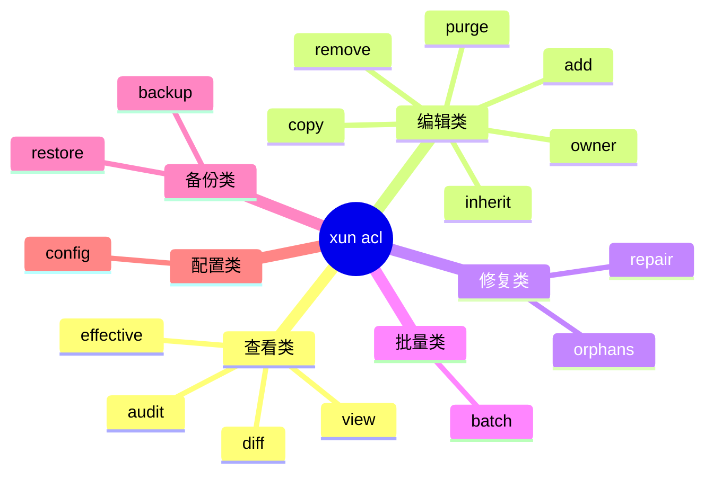

---

## 配置

配置文件存放在 `%APPDATA%\xun\acl_config.toml`（自动创建，缺省值如下）。

| 键名 | 类型 | 默认值 | 说明 |
|------|------|--------|------|
| `throttle_limit` | `usize` | `8` | 并行线程数上限（force_repair 使用） |
| `export_path` | `String` | `%APPDATA%\xun\exports` | CSV / JSON 导出默认目录 |
| `audit_path` | `String` | `%APPDATA%\xun\audit.jsonl` | 审计日志文件路径 |
| `audit_retain_days` | `u32` | `90` | 日志保留天数（超期条目在下次写入时清除） |

使用 `xun acl config` 命令查看当前值；使用 `--set KEY VALUE` 修改单项：

```
xun acl config
xun acl config --set audit_path "D:\logs\acl-audit.jsonl"
xun acl config --set throttle_limit 16
```

---

## 命令详解

### `xun acl view` — 查看 ACL

```
xun acl view -p "D:\Data" --detail
```

| 参数 | 类型 | 说明 |
|------|------|------|
| `-p <path>` | 必填 | 目标路径 |
| `--detail` | switch | 显示每条 ACE 完整信息 |
| `--export <csv>` | 可选 | 导出 ACL 条目到 CSV |

**预期输出（简洁模式）：**

```
Path   : D:\Data
Owner  : BUILTIN\Administrators
Inherit: Enabled

Type    Source    Principal                Rights
------  --------  -----------------------  ---------------
Allow   Explicit  BUILTIN\Administrators   FullControl
Allow   Explicit  NT AUTHORITY\SYSTEM      FullControl
Allow   Inherited BUILTIN\Users            ReadAndExecute
```

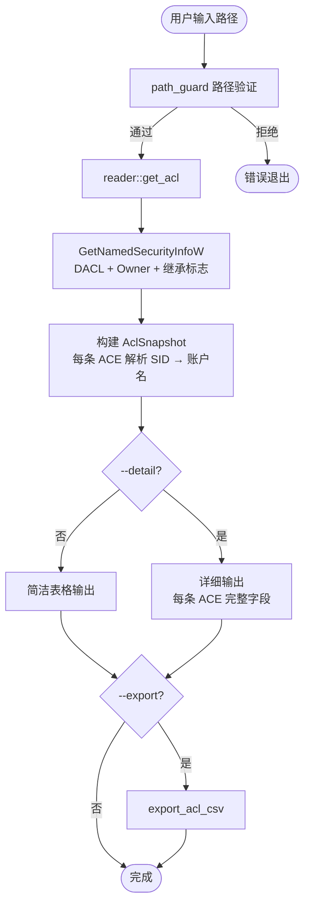

---

### `xun acl add` — 添加权限条目

```
xun acl add -p "D:\Data" --principal "BUILTIN\Users" --rights ReadAndExecute --ace-type Allow --inherit BothInherit -y
```

| 参数 | 类型 | 说明 |
|------|------|------|
| `-p <path>` | 单路径 | 与 --file/--paths 三选一 |
| `--file <txt>` | 文件 | 每行一个路径 |
| `--paths <list>` | 逗号分隔 | 多路径列表 |
| `--principal` | 可选 | 账户名，省略则交互输入 |
| `--rights` | 可选 | FullControl/Modify/ReadAndExecute/Read/Write |
| `--ace-type` | 可选 | Allow \| Deny |
| `--inherit` | 可选 | BothInherit/ContainerOnly/ObjectOnly/None |
| `-y` | switch | 跳过确认 |

**预期输出：**

```
Added ACE: Allow BUILTIN\Users ReadAndExecute [BothInherit] on D:\Data
```

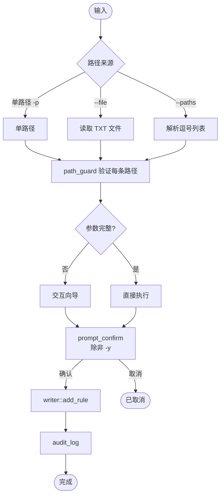

---

### `xun acl remove` — 删除显式 ACE

```
xun acl remove -p "D:\Data" --principal "DOMAIN\OldUser" --ace-type Allow -y
```

| 参数 | 类型 | 说明 |
|------|------|------|
| `-p <path>` | 必填 | 目标路径 |
| `--principal` | 可选 | 按账户名匹配（非交互） |
| `--raw-sid` | 可选 | 按原始 SID 匹配 |
| `--rights` | 可选 | 按权限级别匹配 |
| `--ace-type` | 可选 | Allow \| Deny |
| `-y` | switch | 跳过确认 |

**预期输出：**

```
Removed 1 ACE(s) from D:\Data
```

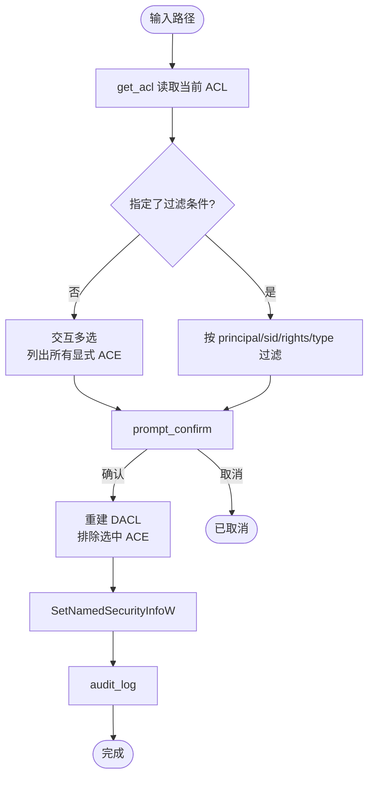

---

### `xun acl purge` — 清除指定账户所有 ACE

```
xun acl purge -p "D:\Data" --principal "DOMAIN\OldUser" -y
```

| 参数 | 类型 | 说明 |
|------|------|------|
| `-p <path>` | 必填 | 目标路径 |
| `--principal` | 可选 | 目标账户，省略则交互选择 |
| `-y` | switch | 跳过确认 |

**预期输出：**

```
Purged all ACEs for DOMAIN\OldUser from D:\Data
```

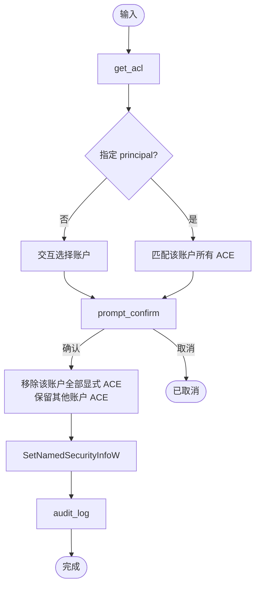

---

### `xun acl diff` — 对比两个路径的 ACL

```
xun acl diff -p "D:\Data" -r "D:\Template" -o diff.csv
```

| 参数 | 类型 | 说明 |
|------|------|------|
| `-p <path>` | 必填 | 目标路径（A） |
| `-r <ref>` | 必填 | 参考路径（B） |
| `-o <csv>` | 可选 | 输出差异 CSV |

**预期输出：**

```
Only in A : 1
Only in B : 0
Common    : 3
Owner     : same
Inherit   : same
```

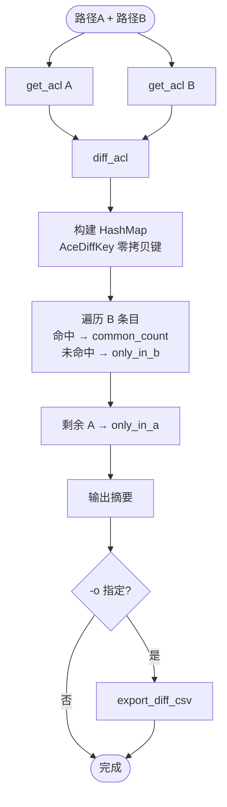

---

### `xun acl effective` — 有效权限计算

```
xun acl effective -p "D:\Data" -u "DOMAIN\Alice"
```

| 参数 | 类型 | 说明 |
|------|------|------|
| `-p <path>` | 必填 | 目标路径 |
| `-u <user>` | 可选 | 指定用户（默认：当前用户） |

**预期输出：**

```
Effective permissions for DOMAIN\Alice on D:\Data

Right            State
---------------  ------
Read             Allow
Write            Allow
Execute          Allow
Delete           Allow
ChangePerms      Deny
TakeOwnership    Deny
```

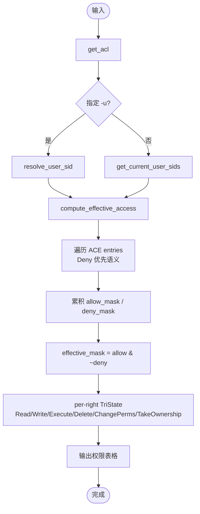

---

### `xun acl copy` — 复制 ACL

```
xun acl copy -p "D:\Target" -r "D:\Template" -y
```

| 参数 | 类型 | 说明 |
|------|------|------|
| `-p <path>` | 必填 | 目标路径 |
| `-r <ref>` | 必填 | 参考路径（ACL 来源） |
| `-y` | switch | 跳过确认 |

> **注意**：此操作会完全替换目标路径的 DACL 和 Owner，原有 ACE 将全部丢失。

**预期输出：**

```
Copied ACL from D:\Template to D:\Target
```

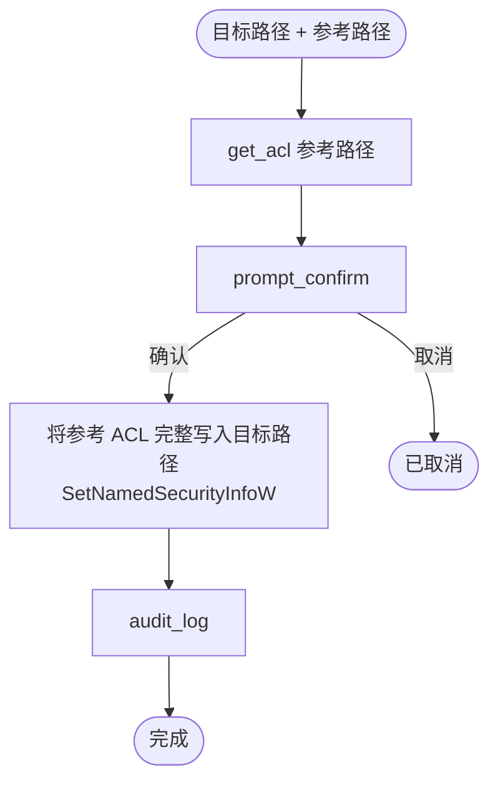

---

### `xun acl backup` — 备份 ACL

```
xun acl backup -p "D:\Data" -o "D:\backups\data_acl.json"
```

| 参数 | 类型 | 说明 |
|------|------|------|
| `-p <path>` | 必填 | 目标路径 |
| `-o <file>` | 可选 | 输出 JSON 文件（省略则自动命名） |

**预期输出：**

```
ACL backed up to D:\backups\data_acl.json
```

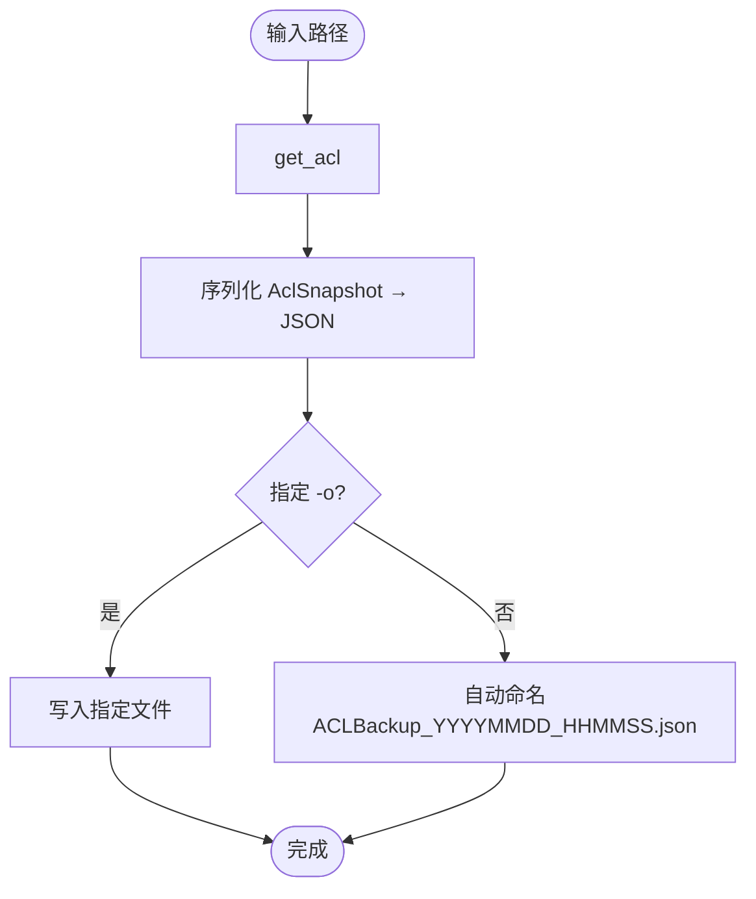

---

### `xun acl restore` — 还原 ACL

```
xun acl restore -p "D:\Data" --from "D:\backups\data_acl.json" -y
```

| 参数 | 类型 | 说明 |
|------|------|------|
| `-p <path>` | 必填 | 目标路径 |
| `--from <file>` | 必填 | 备份 JSON 文件 |
| `-y` | switch | 跳过确认 |

> **注意**：还原操作会覆盖目标路径的当前 DACL、Owner 和继承标志。

**预期输出：**

```
ACL restored to D:\Data from D:\backups\data_acl.json
```

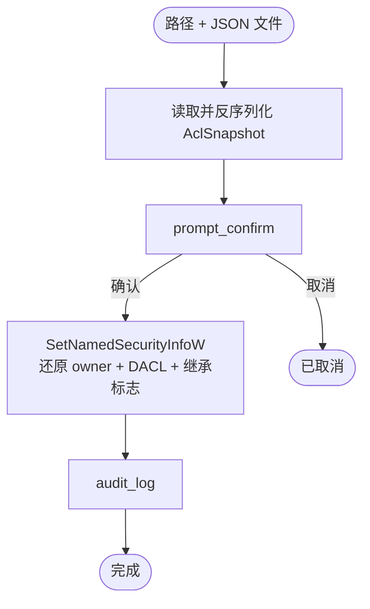

---

### `xun acl inherit` — 继承开关

```
xun acl inherit -p "D:\Data" --disable --preserve true
```

| 参数 | 类型 | 说明 |
|------|------|------|
| `-p <path>` | 必填 | 目标路径 |
| `--disable` | switch | 断开继承 |
| `--enable` | switch | 恢复继承 |
| `--preserve` | bool | 断开时保留继承 ACE 为显式副本（默认 true） |

**预期输出：**

```
Inheritance disabled on D:\Data (inherited ACEs preserved as explicit)
```

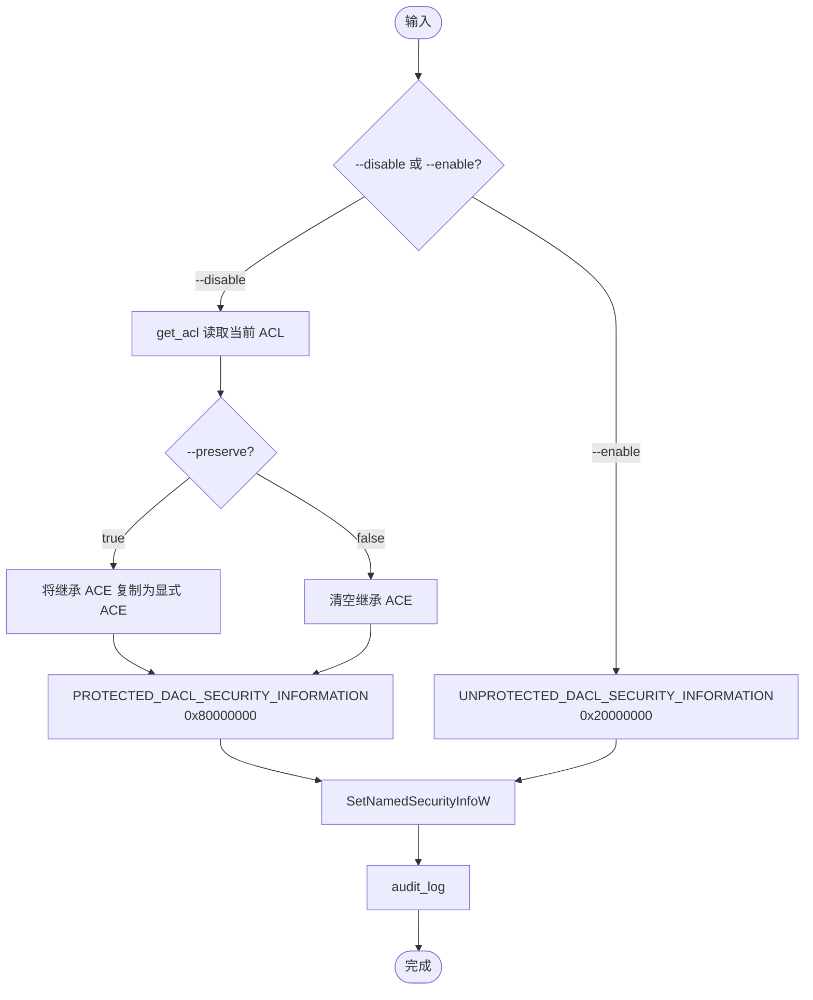

---

### `xun acl owner` — 修改所有者

```
xun acl owner -p "D:\Data" --set "BUILTIN\Administrators" -y
```

| 参数 | 类型 | 说明 |
|------|------|------|
| `-p <path>` | 必填 | 目标路径 |
| `--set <principal>` | 可选 | 新所有者，省略则交互输入 |
| `-y` | switch | 跳过确认 |

**预期输出：**

```
Owner of D:\Data set to BUILTIN\Administrators
```

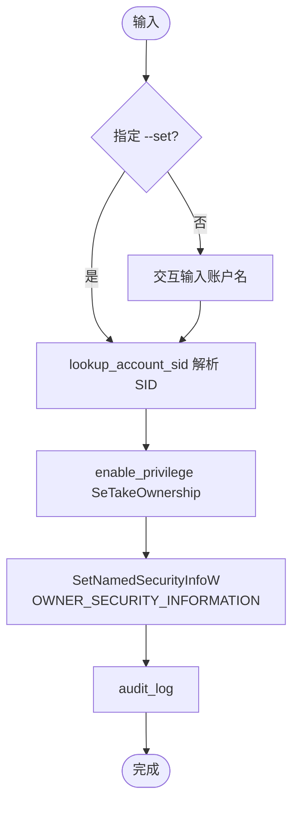

---

### `xun acl orphans` — 孤儿 SID 管理

```
xun acl orphans -p "D:\Data" --recursive true --action both -y
```

| 参数 | 类型 | 说明 |
|------|------|------|
| `-p <path>` | 必填 | 目标路径 |
| `--recursive` | bool | 递归扫描（默认 true） |
| `--action` | 枚举 | none / export / delete / both |
| `--output <csv>` | 可选 | 导出路径 |
| `-y` | switch | 跳过确认 |

**预期输出：**

```
Found 3 orphan SIDs
  SID: S-1-5-21-...  Allow  D:\Data\subdir
  SID: S-1-5-21-...  Deny   D:\Data\file.txt
  ...
Exported 3 rows to D:\exports\ACLOrphans_20260318_120000.csv
Removed 3 / Failed 0
```

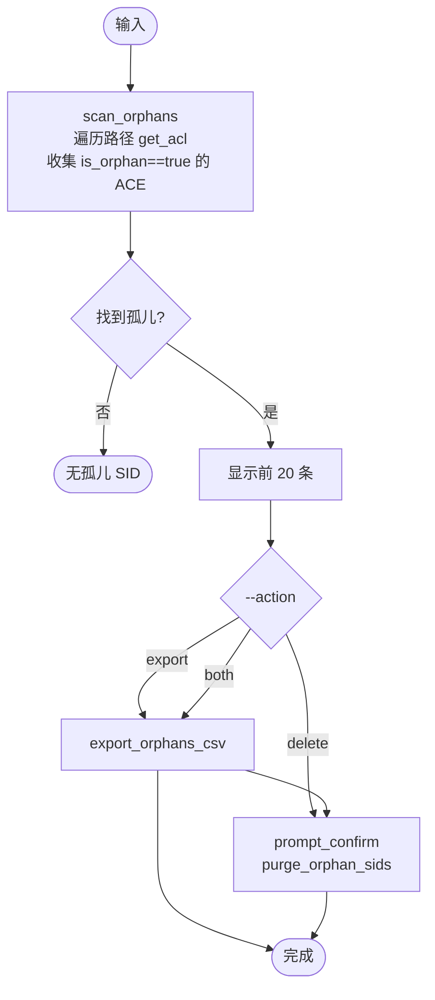

---

### `xun acl repair` — 强制修复

```
xun acl repair -p "D:\Data" --reset-clean --grant "DOMAIN\Alice" -y
```

| 参数 | 类型 | 说明 |
|------|------|------|
| `-p <path>` | 必填 | 目标路径 |
| `--export-errors` | switch | 失败时导出错误 CSV |
| `-y` | switch | 跳过确认 |
| `--reset-clean` | switch | 干净重置模式（见下方流程） |
| `--grant <list>` | 可选 | 额外授权账户（逗号分隔），仅与 `--reset-clean` 配合使用 |

> ⚠️ **破坏性操作**：`--reset-clean` 会永久清除目标路径及所有子对象的自定义 ACE，仅保留 Administrators + SYSTEM（+ grant 列表）的 FullControl。此操作不可撤销，建议先执行 `xun acl backup`。

**预期输出（标准修复）：**

```
Path: D:\Data
Force repair (take ownership + grant FullControl)
This operation is destructive and cannot be undone.
Confirm repair? [y/N] y

Total: 265  Owner OK: 265  ACL OK: 265  Fail: 0
```

**预期输出（干净重置）：**

```
Path: D:\Data
Clean reset: break inheritance + wipe ACL + write Administrators+SYSTEM FullControl
WARNING: all existing ACEs (including custom permissions) will be permanently removed.
This operation is destructive and cannot be undone.
Confirm repair? [y/N] y

Total: 265  Owner OK: 265  ACL OK: 265  Fail: 0
```

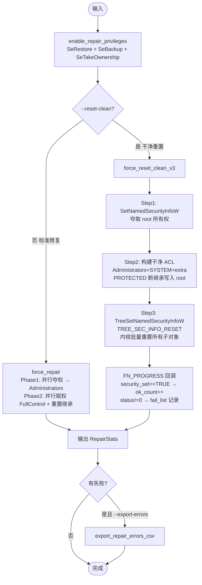

---

### `xun acl batch` — 批量操作

```
xun acl batch --file paths.txt --action repair -y
```

| 参数 | 类型 | 说明 |
|------|------|------|
| `--file <txt>` | 可选 | 每行一个路径的 TXT 文件 |
| `--paths <list>` | 可选 | 逗号分隔路径列表 |
| `--action` | 必填 | repair / backup / orphans / inherit-reset |
| `--output <dir>` | 可选 | 导出输出目录 |
| `-y` | switch | 跳过确认 |

**预期输出：**

```
Processed 5 paths
  OK : 4
  Fail: 1 (see D:\exports\batch_errors_20260318.csv)
```

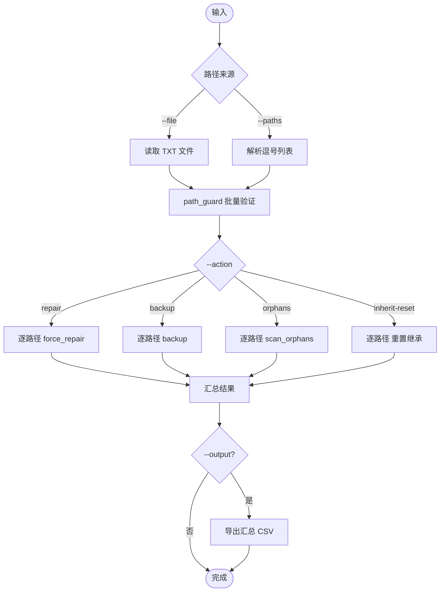

---

### `xun acl audit` — 审计日志

```
xun acl audit --tail 50 --export audit.csv
```

| 参数 | 类型 | 说明 |
|------|------|------|
| `--tail <n>` | 数字 | 显示最后 N 条（默认 30） |
| `--export <csv>` | 可选 | 导出审计日志到 CSV |

**预期输出：**

```
Timestamp                Action         Path         Result  Detail
-----------------------  -------------  -----------  ------  -------------------
2026-03-18T12:00:00+08   ForceRepair    D:\Data      ok      Total=265 Fail=0
2026-03-18T11:30:00+08   AddAce         D:\Docs      ok      Allow BUILTIN\Users
```

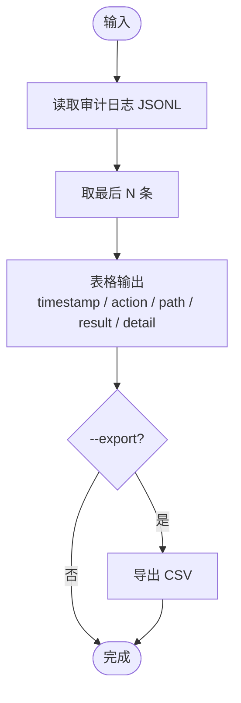

---

### `xun acl config` — 配置管理

```
xun acl config --set audit_path "D:\logs\acl-audit.jsonl"
```

| 参数 | 类型 | 说明 |
|------|------|------|
| `--set KEY VALUE` | 键值对 | 设置配置项（可重复多次） |

**预期输出：**

```
# 查看当前配置
throttle_limit    = 8
export_path       = C:\Users\Alice\AppData\Roaming\xun\exports
audit_path        = C:\Users\Alice\AppData\Roaming\xun\audit.jsonl
audit_retain_days = 90

# 设置后
Set audit_path = D:\logs\acl-audit.jsonl
```

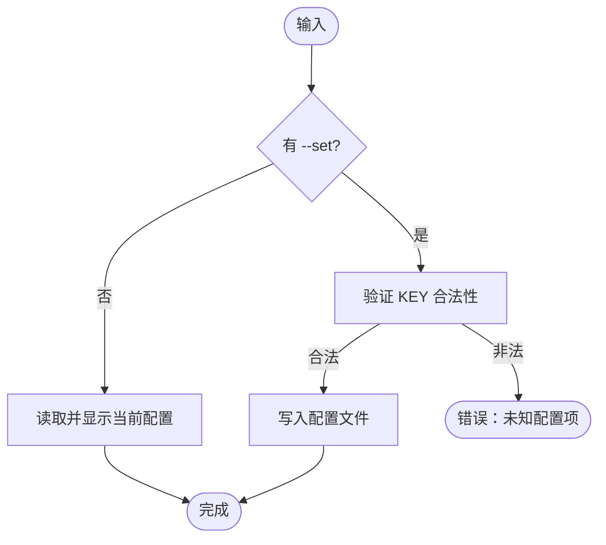

---

## 核心数据类型

```
AceEntry
├── principal: String          # 账户名（DOMAIN\User）
├── raw_sid: String            # 原始 SID 字符串
├── rights_mask: u32           # FileSystemRights 位掩码
├── ace_type: AceType          # Allow | Deny
├── inheritance: InheritanceFlags
│   ├── None             (0x0) # 仅此对象
│   ├── ObjectInherit    (0x1) # 子文件继承
│   ├── ContainerInherit (0x2) # 子目录继承
│   └── Both             (0x3) # OI+CI
├── propagation: PropagationFlags
│   ├── None              (0x0) # 正常传播
│   ├── NoPropagateInherit(0x1) # 不再向下传播
│   └── InheritOnly       (0x2) # 仅继承，不应用于当前对象
├── is_inherited: bool         # 继承自父容器
└── is_orphan: bool            # SID 无法解析

AclSnapshot
├── path: PathBuf
├── owner: String
├── is_protected: bool
└── entries: Vec<AceEntry>

DiffResult
├── only_in_a: Vec<AceEntry>
├── only_in_b: Vec<AceEntry>
├── common_count: usize
├── owner_diff: Option<(String, String)>
└── inherit_diff: Option<(bool, bool)>

RepairStats
├── total: usize
├── owner_ok: usize
├── owner_fail: Vec<(PathBuf, String)>
├── acl_ok: usize
└── acl_fail: Vec<(PathBuf, String)>
```

---

## 权限掩码对照表

| 短名 | 掩码（十进制） | 说明 |
|------|--------------|------|
| FullControl | 2,032,127 | 读/写/执行/删除/改ACL/取所有权 |
| Modify | 1,245,631 | 读/写/执行/删除，不含改ACL |
| ReadAndExecute | 1,179,817 | 查看内容并运行程序 |
| Read+Write | 1,180,086 | 查看并修改内容，不能运行或删除 |
| Read | 1,179,785 | 仅查看文件和目录内容 |
| Write | 278 | 可创建/修改文件，不含读取 |

> 计算时自动屏蔽 `Synchronize`（0x00100000）位以避免误匹配。

---

## 模块目录结构

```
src/acl/
├── mod.rs                 # 模块入口，统一导出
├── types/
│   └── mod.rs             # 核心数据类型
├── reader/
│   └── mod.rs             # DACL 读取 → AclSnapshot
├── writer/
│   ├── mod.rs
│   └── apply/
│       ├── mod.rs
│       └── dacl.rs        # SetNamedSecurityInfoW 封装
├── diff.rs                # 快照集合差（AceDiffKey 零拷贝）
├── effective.rs           # 有效权限计算（TriState）
├── repair.rs              # 强制修复 / clean-reset V3
├── orphan.rs              # 孤儿 SID 扫描与清除
├── export/
│   ├── mod.rs
│   └── format.rs          # CSV 导出
├── audit.rs               # 操作审计日志（JSONL）
├── privilege.rs           # Windows 特权激活
└── error.rs               # AclError / Win32 错误包装
```

---

## 性能基准（662,397 对象）

| 实现 | 策略 | total_wall | 说明 |
|------|------|-----------|------|
| V1 | 用户态 rayon 并行逐文件 SetNamedSecurityInfoW | 224s | 662k 次 syscall |
| V2 | TreeSetNamedSecurityInfoW，无错误捕获 | 126s | 1 次内核调用 |
| **V3（当前）** | TreeSetNamedSecurityInfoW + FN_PROGRESS 错误捕获 | **106s** | 内核批量 + 细粒度报告 |

---

## 错误处理

```
AclError
├── Win32(u32)            # GetLastError() 原始错误码
├── AccessDenied          # 0x5，权限不足
├── InvalidParameter      # 0x57，参数错误
├── InvalidAcl            # 0x538，ACL 结构无效
└── Other(String)         # 其它系统错误
```

所有公开函数返回 `anyhow::Result<T>`，错误链保留完整调用上下文。

---

## 注意事项

- `repair --reset-clean` 使用内核级 `TreeSetNamedSecurityInfoW(TREE_SEC_INFO_RESET)`，适用于用户数据目录；**不要在系统目录（如 `C:\Windows`、`C:\Program Files`）上使用**。
- `orphans --action delete` 会永久移除孤儿 SID，删除前建议先用 `--action export` 保存记录。
- 审计日志为追加写入，超期条目在**下次写入时**清除；若长期未执行命令，旧条目不会自动删除。
- `batch` 当前为串行逐路径执行；大规模批量建议改用 `repair` 的内置并行模式。
