# alias 模块

> **xun alias** 提供 Windows 下的命令别名与应用快捷方式管理，通过 `.shim` + `.exe` 机制将别名注入 Shell 和系统 App Paths，共 11 条子命令。

---

## 概述

### 职责边界

| 能力 | 说明 |
|------|------|
| Shell 别名 | 将任意命令字符串注册为短名，写入 CMD / PowerShell / Bash / Nu profile |
| App 别名 | 将 `.exe` 路径注册为短名，生成 shim exe + 可选 Windows App Paths 注册表条目 |
| Shim 生成 | 根据 `AliasMode` 自动判断 Exe / Cmd 两种 shim 类型，PE 头内嵌目标路径 |
| 扫描发现 | 从注册表 / 开始菜单 / PATH 环境变量自动发现已安装应用 |
| 导入导出 | TOML 格式序列化，支持跨机器迁移 |
| 同步 | 一键重建所有 shim、Shell profile、App Paths 注册表 |

### 前置条件

- **平台**：仅限 Windows（shim 生成依赖 PE 格式；App Paths 依赖 Win32 注册表）
- **权限**：Shell 别名操作仅需普通用户权限；`app add --register-apppaths` 写注册表需要管理员权限
- **首次使用**：执行 `xun alias setup` 初始化目录结构和 shim 模板文件
- **配置文件**：`%APPDATA%\xun\aliases.toml`（可通过 `--config` 覆盖）

---

## 权限要求

| 命令 | 最低权限 | 说明 |
|------|---------|------|
| `setup` | 普通用户 | 创建目录、写 profile |
| `add` | 普通用户 | 写 TOML + 生成 shim |
| `rm` | 普通用户 | 删除 shim 条目 |
| `ls` | 普通用户 | 只读 |
| `find` | 普通用户 | 只读 |
| `which` | 普通用户 | 只读 |
| `sync` | 普通用户 / 管理员 | App Paths 写注册表需管理员 |
| `export` | 普通用户 | 只读 |
| `import` | 普通用户 | 写 TOML + 生成 shim |
| `app add` | 普通用户 / 管理员 | `--register-apppaths` 需管理员 |
| `app rm` | 普通用户 / 管理员 | 注销 App Paths 需管理员 |
| `app ls` | 普通用户 | 只读 |
| `app scan` | 普通用户 | 只读注册表 / 文件系统 |
| `app sync` | 普通用户 / 管理员 | App Paths 同步需管理员 |
| `app which` | 普通用户 | 只读 |

---

## 命令总览

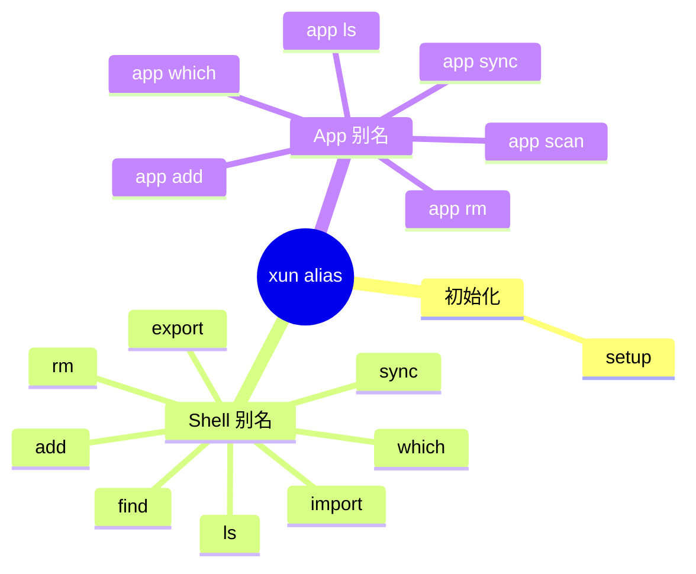

---

## 配置

配置文件：`%APPDATA%\xun\aliases.toml`

```toml
# Shell 别名条目
[alias.gs]
command = "git status"
desc    = "git status shortcut"      # 可选，描述
tags    = ["git"]                     # 可选，标签列表
shells  = ["ps", "cmd"]              # 可选，限定 Shell（空 = 所有）
mode    = "auto"                      # auto | exe | cmd

# App 别名条目
[app.code]
exe              = "C:\\Program Files\\Microsoft VS Code\\Code.exe"
args             = ""                  # 可选，固定附加参数
desc             = "Visual Studio Code" # 可选
tags             = ["editor"]          # 可选
register_apppaths = true               # 是否写入 Windows App Paths（默认 true）
```

### 配置项说明

| 字段 | 类型 | 默认 | 说明 |
|------|------|------|------|
| `alias.<name>.command` | String | 必填 | 展开命令字符串 |
| `alias.<name>.desc` | String? | null | 描述 |
| `alias.<name>.tags` | Vec\<String\> | [] | 分组标签 |
| `alias.<name>.shells` | Vec\<String\> | [] | 限定生效的 Shell（空=全部） |
| `alias.<name>.mode` | AliasMode | auto | shim 类型：auto / exe / cmd |
| `app.<name>.exe` | String | 必填 | 目标 exe 完整路径 |
| `app.<name>.args` | String? | null | 固定附加参数 |
| `app.<name>.desc` | String? | null | 描述 |
| `app.<name>.tags` | Vec\<String\> | [] | 分组标签 |
| `app.<name>.register_apppaths` | bool | true | 是否注册到 Windows App Paths |

### AliasMode 说明

| 值 | 行为 |
|----|------|
| `auto` | 检测命令是否含 `\|`、`&&`、`>` 等 shell 操作符，自动选择 Cmd 或 Exe |
| `exe` | 强制生成 Exe shim（直接启动目标进程，无 cmd.exe 中间层） |
| `cmd` | 强制生成 Cmd shim（通过 cmd.exe /c 执行，支持 shell 管道/重定向） |

---

## 命令详解

### `xun alias setup` — 初始化

```
xun alias setup --no-ps --core-only
```

| 参数 | 类型 | 说明 |
|------|------|------|
| `--config <path>` | 可选 | 覆盖配置文件路径 |
| `--no-cmd` | switch | 跳过 CMD profile 写入 |
| `--no-ps` | switch | 跳过 PowerShell profile 写入 |
| `--no-bash` | switch | 跳过 Bash profile 写入 |
| `--no-nu` | switch | 跳过 Nu profile 写入 |
| `--core-only` | switch | 仅初始化 CMD + PS（等价于 --no-bash --no-nu） |

**预期输出：**

```
Alias setup completed.
Config: C:\Users\Alice\AppData\Roaming\xun\aliases.toml
Shims : C:\Users\Alice\AppData\Roaming\xun\shims
Template(console): C:\Users\Alice\AppData\Roaming\xun\shim-template.exe
Template(gui)    : C:\Users\Alice\AppData\Roaming\xun\shim-template-gui.exe
Updated PowerShell profile: C:\Users\Alice\Documents\PowerShell\Microsoft.PowerShell_profile.ps1
Updated CMD profile: C:\Users\Alice\AppData\Roaming\xun\cmd_init.cmd
```

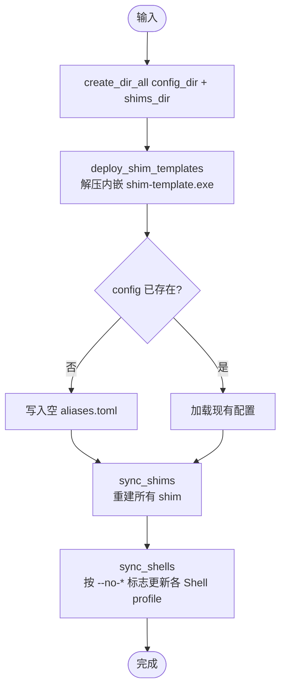

---

### `xun alias add` — 添加 Shell 别名

```
xun alias add gs "git status" --desc "git status" --tags git --mode auto
```

| 参数 | 类型 | 说明 |
|------|------|------|
| `<name>` | 必填 | 别名名称 |
| `<command>` | 必填 | 展开命令 |
| `--desc <s>` | 可选 | 描述 |
| `--tags <csv>` | 可选 | 标签（逗号分隔，可重复） |
| `--shell <csv>` | 可选 | 限定 Shell（逗号分隔） |
| `--mode <m>` | 可选 | auto / exe / cmd（默认 auto） |
| `--force` | switch | 覆盖已存在的别名 |

**预期输出：**

```
Alias added.
Updated PowerShell profile: ...
Updated CMD profile: ...
```

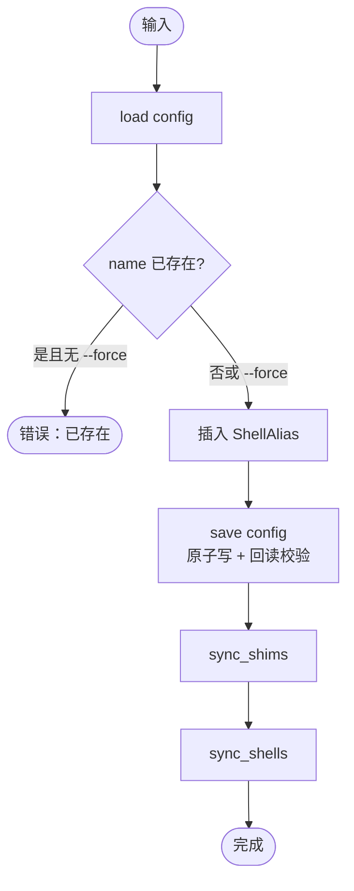

---

### `xun alias rm` — 删除别名

```
xun alias rm gs ll
```

| 参数 | 类型 | 说明 |
|------|------|------|
| `<names...>` | 必填 | 一个或多个别名名称 |

**预期输出：**

```
Removed: gs
Removed: ll
```

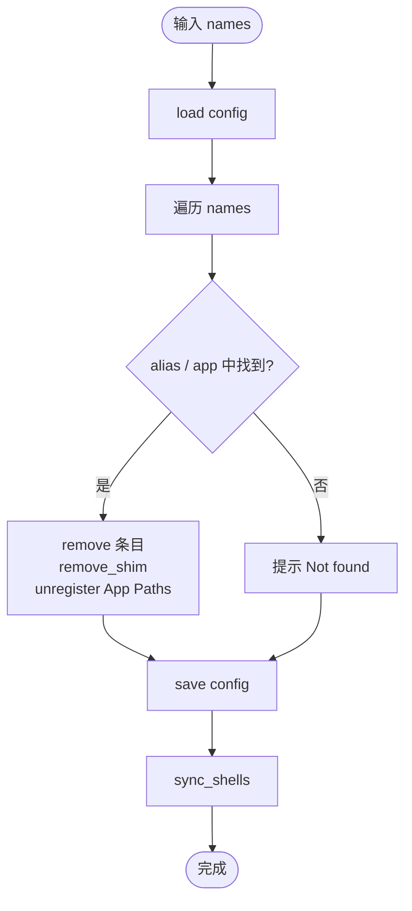

---

### `xun alias ls` — 列出别名

```
xun alias ls --type cmd --tag git --json
```

| 参数 | 类型 | 说明 |
|------|------|------|
| `--type <t>` | 可选 | cmd / app（不指定则两者都显示） |
| `--tag <tag>` | 可选 | 按标签过滤 |
| `--json` | switch | 输出 JSON |

**预期输出：**

```
Name  Command      Mode  Shells  Desc
----  -----------  ----  ------  ----
gs    git status   auto  all     git status shortcut
ll    ls -la       auto  ps      list files
```

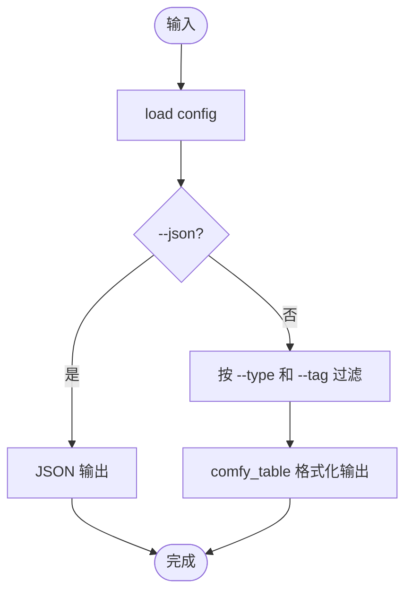

---

### `xun alias find` — 模糊搜索

```
xun alias find git
```

| 参数 | 类型 | 说明 |
|------|------|------|
| `<keyword>` | 必填 | 搜索关键词 |

**预期输出：**

```
Type/Name   Target      Desc                 Score
----------  ----------  -------------------  -----
[cmd] gs    git status  git status shortcut  90
[cmd] gp    git push    push to remote       45
```

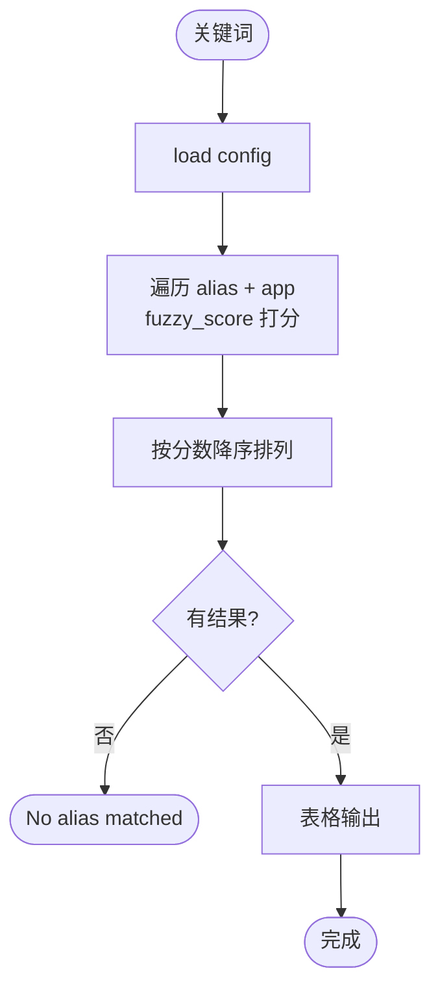

---

### `xun alias which` — 查看 shim 详情

```
xun alias which gs
```

| 参数 | 类型 | 说明 |
|------|------|------|
| `<name>` | 必填 | 别名名称 |

**预期输出：**

```
Name: gs
Target: git status
Shim exe : C:\Users\Alice\AppData\Roaming\xun\shims\gs.exe
Shim file: C:\Users\Alice\AppData\Roaming\xun\shims\gs.shim
.shim content:
type = cmd
wait = true
cmd = git status
```

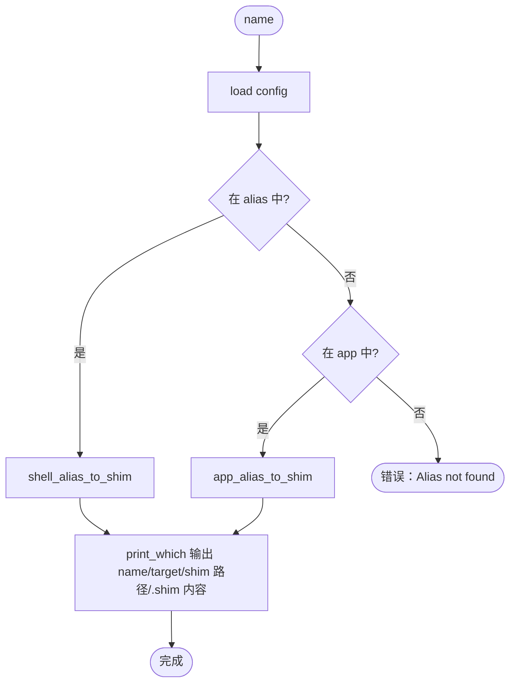

---

### `xun alias sync` — 全量同步

```
xun alias sync
```

无额外参数。重建所有 shim、更新 Shell profile、同步 App Paths 注册表。

**预期输出：**

```
Updated PowerShell profile: ...
Updated CMD profile: ...
App Paths synced: +3 / -1
```

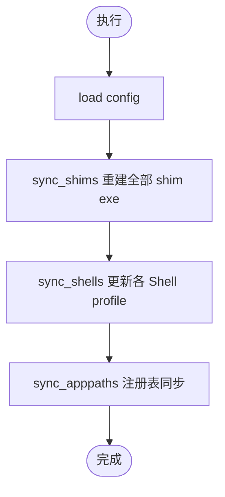

---

### `xun alias export` — 导出配置

```
xun alias export -o aliases_backup.toml
```

| 参数 | 类型 | 说明 |
|------|------|------|
| `-o <file>` | 可选 | 输出文件路径（省略则打印到 stdout） |

**预期输出：**

```
Exported aliases to aliases_backup.toml
```

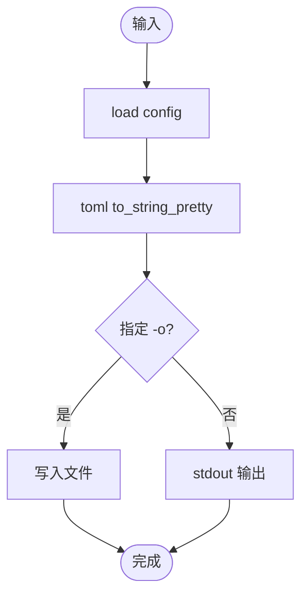

---

### `xun alias import` — 导入配置

```
xun alias import aliases_backup.toml --force
```

| 参数 | 类型 | 说明 |
|------|------|------|
| `<file>` | 必填 | 源 TOML 文件 |
| `--force` | switch | 覆盖已存在的条目 |

**预期输出：**

```
Imported aliases: added=5, skipped=2
Updated PowerShell profile: ...
```

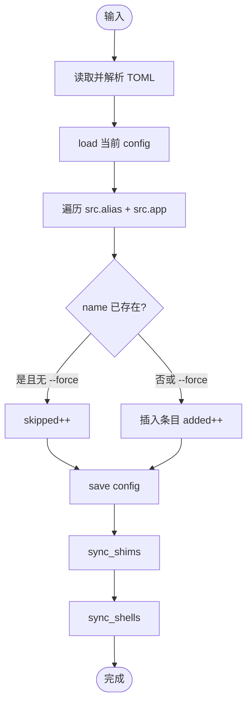

---

### `xun alias app add` — 添加 App 别名

```
xun alias app add code "C:\Program Files\Microsoft VS Code\Code.exe" --desc "VS Code"
```

| 参数 | 类型 | 说明 |
|------|------|------|
| `<name>` | 必填 | 别名名称 |
| `<exe>` | 必填 | 目标 exe 完整路径 |
| `--args <s>` | 可选 | 固定附加参数 |
| `--desc <s>` | 可选 | 描述 |
| `--tags <csv>` | 可选 | 标签 |
| `--no-apppaths` | switch | 不注册到 Windows App Paths |
| `--force` | switch | 覆盖已存在的条目 |

**预期输出：**

```
App alias added: code
Updated PowerShell profile: ...
```

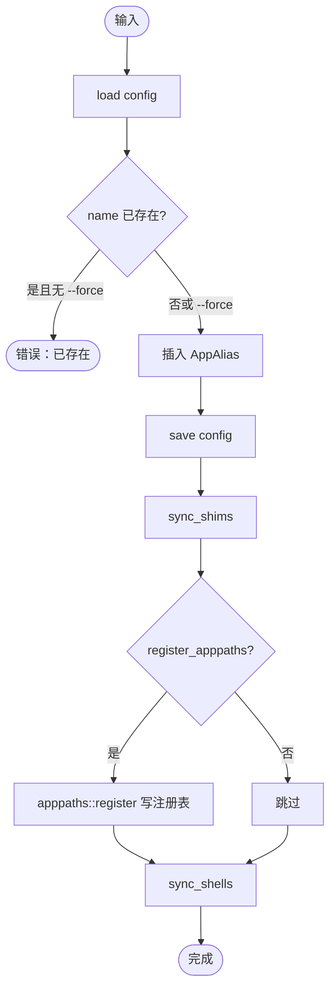

---

### `xun alias app rm` — 删除 App 别名

```
xun alias app rm code notepad
```

| 参数 | 类型 | 说明 |
|------|------|------|
| `<names...>` | 必填 | 一个或多个 App 别名名称 |

**预期输出：**

```
Removed app alias: code
Removed app alias: notepad
```

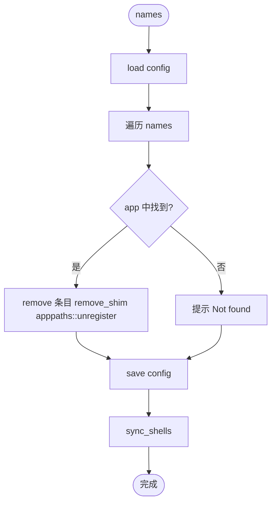

---

### `xun alias app ls` — 列出 App 别名

```
xun alias app ls --json
```

| 参数 | 类型 | 说明 |
|------|------|------|
| `--json` | switch | JSON 输出 |

**预期输出：**

```
Name   Executable                        Args  AppPaths  Desc
-----  --------------------------------  ----  --------  ------------------
code   C:\Program Files\...\Code.exe           yes       Visual Studio Code
```

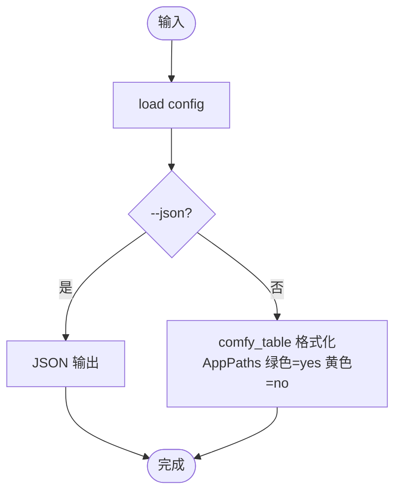

---

### `xun alias app scan` — 扫描发现应用

```
xun alias app scan --source all --filter code --all
```

| 参数 | 类型 | 说明 |
|------|------|------|
| `--source <s>` | 可选 | registry / startmenu / path / all（默认 all） |
| `--filter <kw>` | 可选 | 按名称/路径过滤 |
| `--no-cache` | switch | 跳过缓存强制重新扫描 |
| `--all` | switch | 自动选择全部结果（跳过交互选择） |
| `--json` | switch | JSON 输出扫描结果（不导入） |

**预期输出：**

```
  1. code <- Visual Studio Code (registry)
     C:\Program Files\Microsoft VS Code\Code.exe
Select entries (1,3-5,a): 1
Added app aliases: 1
```

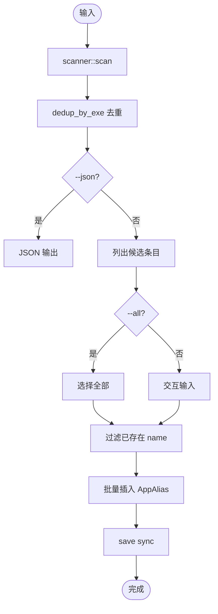

---

### `xun alias app sync` — 同步 App 别名

```
xun alias app sync
```

**预期输出：**

```
App aliases synced: apppaths +3 / -1
```

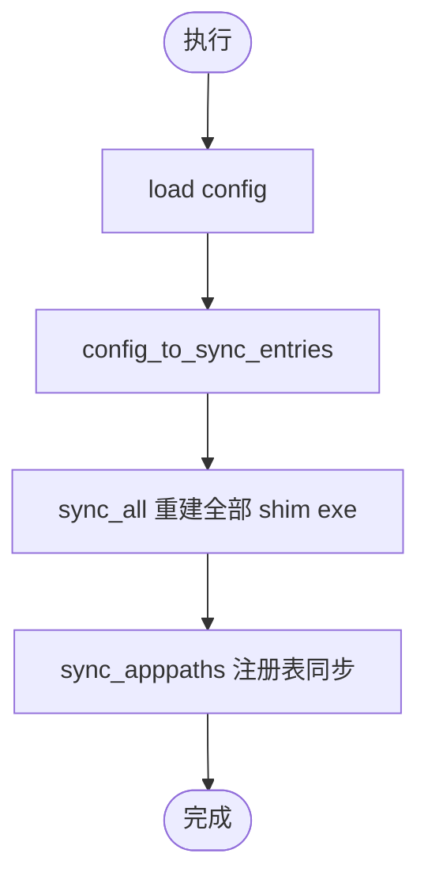

---

### `xun alias app which` — 查看 App shim 详情

```
xun alias app which code
```

| 参数 | 类型 | 说明 |
|------|------|------|
| `<name>` | 必填 | App 别名名称 |

**预期输出：**

```
Name: code
Target: C:\Program Files\Microsoft VS Code\Code.exe
Shim exe : C:\Users\Alice\AppData\Roaming\xun\shims\code.exe
Shim file: C:\Users\Alice\AppData\Roaming\xun\shims\code.shim
.shim content:
type = exe
path = C:\Program Files\Microsoft VS Code\Code.exe
```

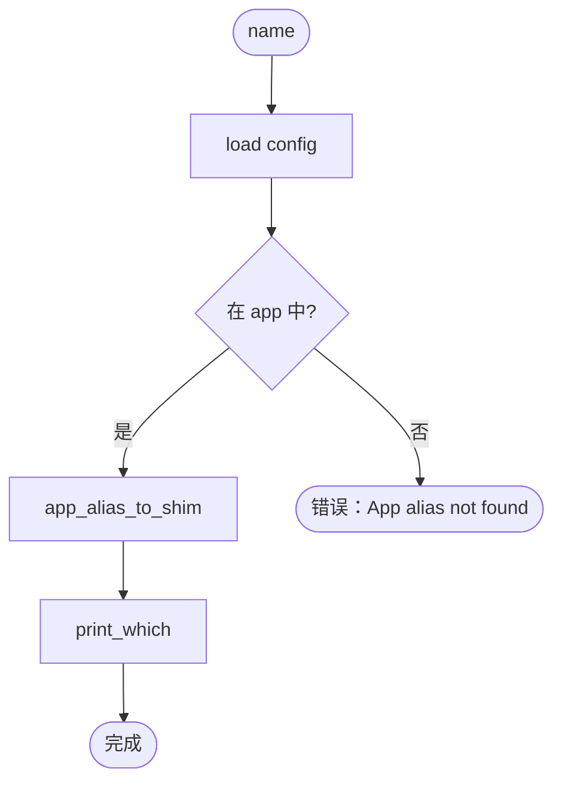

---

## 核心数据类型

```
Config
├── alias: BTreeMap<String, ShellAlias>   # Shell 别名表
└── app:   BTreeMap<String, AppAlias>     # App 别名表

ShellAlias
├── command: String
├── desc:    Option<String>
├── tags:    Vec<String>
├── shells:  Vec<String>     # 空 = 全部 Shell
└── mode:    AliasMode       # auto | exe | cmd

AppAlias
├── exe:               String
├── args:              Option<String>
├── desc:              Option<String>
├── tags:              Vec<String>
└── register_apppaths: bool

ShimKind
├── Exe { path, fixed_args }  # 直接启动目标进程
└── Cmd { command }           # 通过 cmd.exe /c 执行

SyncEntry
├── name:             String
├── shim_content:     String
└── use_gui_template: bool

SyncReport
├── created: Vec<String>
├── removed: Vec<String>
└── errors:  Vec<(String, String)>

AppEntry
├── name:         String
├── display_name: String
├── exe_path:     String
└── source:       Source   # Registry | StartMenu | PathEnv
```

---

## 模块目录结构

```
src/alias/
├── mod.rs               # 入口，路由 11 条子命令
├── config.rs            # Config / ShellAlias / AppAlias / AliasMode
├── context.rs           # AliasCtx，封装路径 + sync 方法
├── shell_alias_cmd.rs   # setup / add / rm / export / import
├── app_alias_cmd.rs     # app add / rm / ls / scan
├── query.rs             # ls / find / which / app which
├── sync.rs              # sync / app sync
├── apppaths.rs          # Windows App Paths 注册表读写
├── output.rs            # fuzzy_score / parse_selection
├── error.rs             # anyhow::Error -> CliError
├── scanner/
│   ├── mod.rs           # scan() / AppEntry / ScanSource
│   ├── cache.rs         # 扫描缓存
│   ├── registry.rs      # HKLM/HKCU Uninstall 扫描
│   ├── startmenu.rs     # 开始菜单 .lnk 扫描
│   └── path_env.rs      # PATH 环境变量扫描
├── shell/
│   ├── mod.rs           # ShellBackend trait / UpdateResult
│   ├── cmd.rs           # CmdBackend
│   ├── ps.rs            # PsBackend
│   ├── bash.rs          # BashBackend（feature: alias-shell-extra）
│   └── nu.rs            # NuBackend（feature: alias-shell-extra）
└── shim_gen/
    ├── mod.rs           # ShimKind / SyncEntry / SyncReport
    ├── classify.rs      # classify_mode
    ├── render.rs        # shell_alias_to_shim / app_alias_to_shim
    ├── sync.rs          # sync_all / remove_shim
    ├── template.rs      # deploy_shim_templates
    ├── pe_patch.rs      # PE 头补丁
    └── io.rs            # shim 文件读写
```

---

## 错误处理

```
CliError
├── code:    i32
├── message: String
└── details: Vec<String>   # anyhow 错误链
```

所有公开函数返回 `anyhow::Result<T>`，通过 `to_cli_error()` 转换为 `CliError` 后输出。

---

## 注意事项

- `app add` 默认注册 Windows App Paths（`HKCU\Software\Microsoft\Windows\CurrentVersion\App Paths`），使应用可通过 Win+R 或 `Start-Process` 直接按名称调用；使用 `--no-apppaths` 跳过。
- 配置保存采用原子写（临时文件 + `MoveFileExW`）+ 回读校验 + `.bak` 自动备份，写入失败时自动回滚。
- shim exe 内嵌于二进制（`include_bytes!`），首次 `setup` 时解压到 shims 目录，无需外部依赖。
- `--core-only` 仅初始化 CMD + PowerShell，跳过 Bash / Nu（适合不需要 WSL 场景）。
- `app scan` 结果按来源优先级去重（Registry > StartMenu > PathEnv），同一 exe 路径只保留最高优先级来源。
