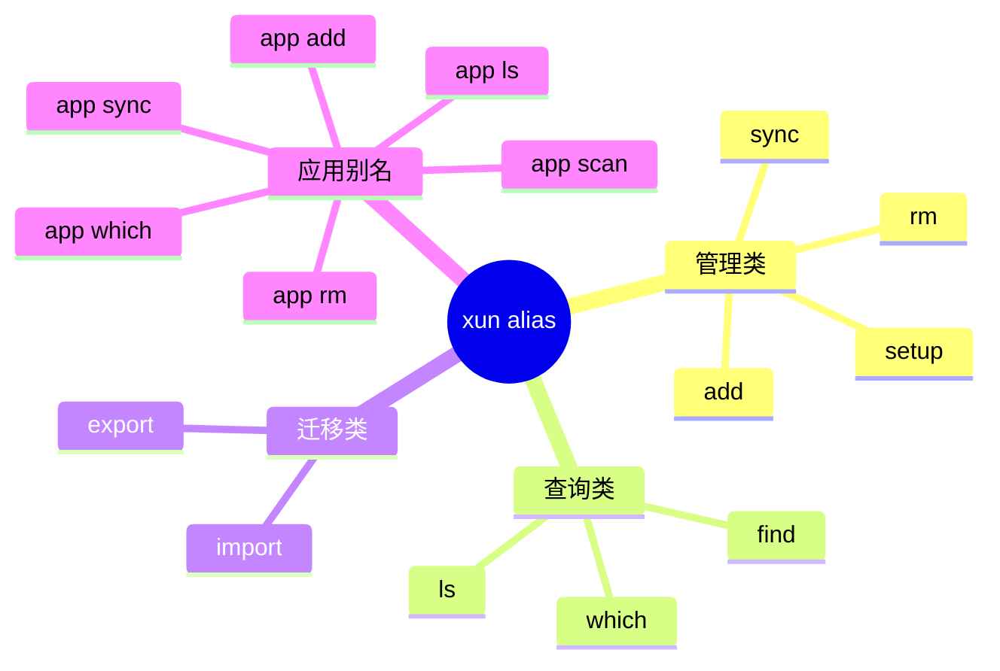
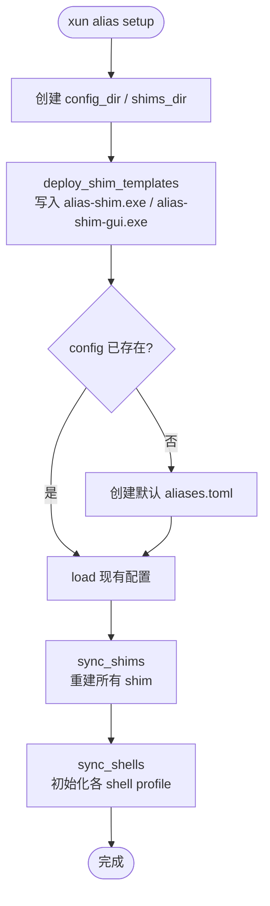
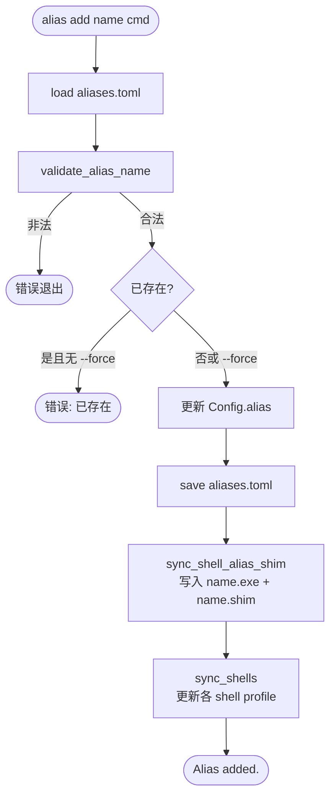
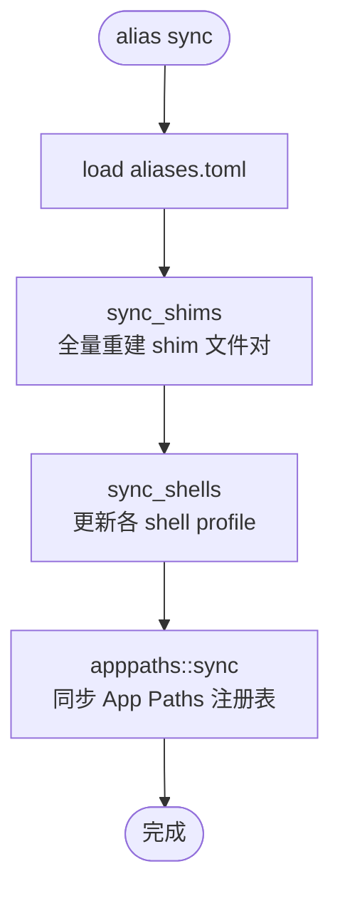
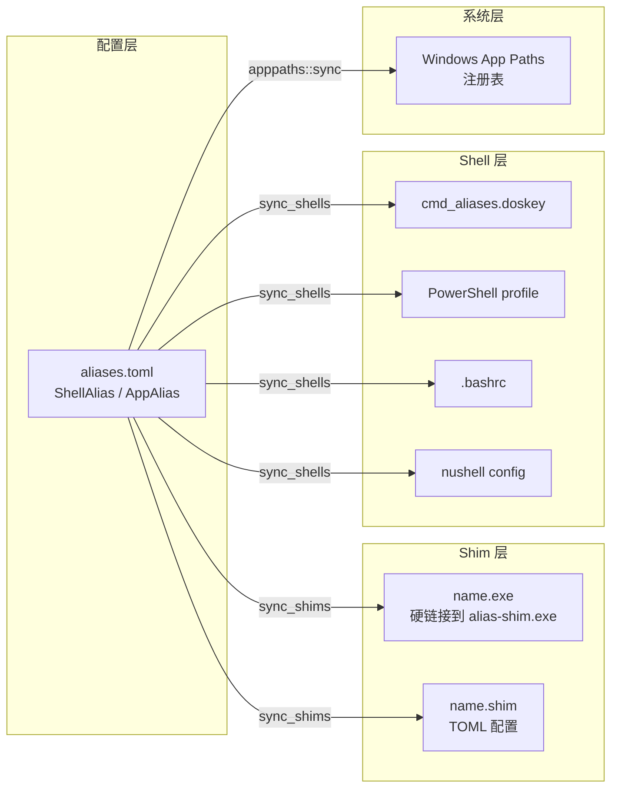

# alias 模块

> **xun alias** 提供跨 Shell 命令别名与应用快捷方式的统一管理能力，通过 shim 机制将别名注册为独立可执行文件，支持 cmd、PowerShell、Bash、Nushell 四种 Shell 后端，共 14 条子命令。

---

## 概述

### 职责边界

| 能力 | 说明 |
|------|------|
| Shell 别名 | 将命令字符串注册为别名，写入各 Shell 的 profile 文件 |
| 应用别名 | 将 GUI/控制台 exe 注册为别名，可选注册到 Windows App Paths |
| Shim 生成 | 为每条别名生成独立的 `.exe` + `.shim` 文件对，可直接在 PATH 中调用 |
| 批量管理 | export/import 支持别名配置的跨机器迁移 |
| 查询 | find（模糊搜索）、ls（列表/过滤）、which（定位 shim 文件）|
| 同步 | sync 重建所有 shim 与 shell profile，幂等可重复执行 |

### 前置条件

- **平台**：仅限 Windows（shim 运行时依赖 Win32 API；Shell profile 写入依赖 cmd/PowerShell 路径约定）
- **初始化**：首次使用前必须执行 `xun alias setup`，部署 shim 模板并初始化 Shell profile
- **编译**：需启用 feature flag `--features alias`，并预先构建 shim 可执行文件：
  ```
  cargo build -p alias-shim --profile release-shim
  ```

---

## 核心概念

### Shim 机制

每条别名在 shims 目录（`%APPDATA%\xun\shims\`）下生成两个文件：

| 文件 | 说明 |
|------|------|
| `<name>.exe` | alias-shim 可执行文件的硬链接（约 240KB） |
| `<name>.shim` | TOML 格式配置文件，记录 type/cmd/wait 等字段 |

shim 启动时读取同名 `.shim` 文件，按配置方式执行目标命令，无需 Shell 环境即可调用。

### AliasMode（执行模式）

| 模式 | 说明 | 典型耗时 |
|------|------|----------|
| `auto` | 自动检测：PATH 中存在的命令识别为 `exe`，含管道/重定向/`&&` 的识别为 `cmd` | — |
| `exe` | 直接 `CreateProcess` 启动目标，无需 cmd.exe 中间层 | 2–5 ms |
| `cmd` | 通过 `cmd.exe /c` 执行，支持 Shell 内建特性 | 15–30 ms |

### Shell 后端

| 后端 | profile 文件 | 别名写入方式 |
|------|-------------|-------------|
| `cmd` | `%APPDATA%\xun\cmd_aliases.doskey` | `doskey name=cmd $*` / `doskey name=exe $*` |
| `powershell` | `$PROFILE`（Microsoft.PowerShell_profile.ps1）| `Set-Alias name cmd` / `function name { cmd @args }` |
| `bash` | `~/.bashrc`（feature: alias-shell-extra）| `alias name='cmd'` |
| `nu` | nushell config（feature: alias-shell-extra）| `alias name = cmd` |

> **写入优化**：所有 Shell profile 写入均使用 content diff 跳过机制——内容未变时不写盘、不更新 mtime。

### 名称校验规则

别名名称通过 `validate_alias_name()` 校验，拒绝以下情况：

- 空字符串
- 包含 Windows 文件系统非法字符：`< > : " / \ | ? *`
- 包含空格
- 以 `.` 开头或结尾

---

## 配置

配置文件：`%APPDATA%\xun\aliases.toml`（通过 `--config <path>` 覆盖）

**Shell 别名条目：**

```toml
[alias.gs]
command = "git status"
mode = "auto"          # auto | exe | cmd
desc = "show git status"
tags = ["git"]
shells = []            # 为空时注入所有 shell，指定则只注入对应 shell
```

**应用别名条目：**

```toml
[app.code]
exe = "C:\\Users\\me\\AppData\\Local\\Programs\\Microsoft VS Code\\Code.exe"
args = "--reuse-window"
desc = "Visual Studio Code"
tags = ["editor"]
register_apppaths = true   # 注册到 Windows App Paths 注册表
```

---

## 命令总览



---

## 命令详解

### `xun alias setup` — 初始化运行时

```
xun alias setup [--no-cmd] [--no-ps] [--no-bash] [--no-nu] [--core-only]
```

| 参数 | 类型 | 说明 |
|------|------|------|
| `--no-cmd` | switch | 跳过 cmd 后端初始化 |
| `--no-ps` | switch | 跳过 PowerShell 后端初始化 |
| `--no-bash` | switch | 跳过 Bash 后端初始化 |
| `--no-nu` | switch | 跳过 Nushell 后端初始化 |
| `--core-only` | switch | 仅初始化 cmd + PowerShell（等价于 --no-bash --no-nu）|

**预期输出：**

```
Alias setup completed.
Config: C:\Users\me\AppData\Roaming\xun\aliases.toml
Shims : C:\Users\me\AppData\Roaming\xun\shims
Template(console): C:\Users\me\AppData\Roaming\xun\alias-shim.exe
Template(gui)    : C:\Users\me\AppData\Roaming\xun\alias-shim-gui.exe
```



---

### `xun alias add` — 添加 Shell 别名

```
xun alias add <name> <command> [--mode auto|exe|cmd] [--desc <text>] [--tag <tag>] [--shell cmd|ps|bash|nu] [--force]
```

| 参数 | 类型 | 说明 |
|------|------|------|
| `name` | 必填 | 别名名称（须通过名称校验）|
| `command` | 必填 | 目标命令字符串 |
| `--mode` | 可选 | 执行模式：auto\|exe\|cmd（默认 auto）|
| `--desc` | 可选 | 描述信息 |
| `--tag` | 可选，可重复 | 标签（逗号分隔或多次指定）|
| `--shell` | 可选，可重复 | 限定 Shell 后端（为空则注入全部）|
| `--force` | switch | 覆盖同名别名 |

**示例：**

```
xun alias add gs "git status"
xun alias add gst "git status" --desc "show status" --tag git
xun alias add psonly "Get-Process" --shell ps
xun alias add myls "ls -la" --mode cmd --force
```

**预期输出：**

```
Alias added.
```



---

### `xun alias rm` — 删除别名

```
xun alias rm <name> [<name>...]
```

| 参数 | 类型 | 说明 |
|------|------|------|
| `name` | 必填，可多个 | 要删除的别名名称（shell 和 app 别名均可）|

**预期输出：**

```
Removed: gs
```

---

### `xun alias ls` — 列出别名

```
xun alias ls [--type cmd|app] [--tag <tag>] [--json]
```

| 参数 | 类型 | 说明 |
|------|------|------|
| `--type` | 可选 | 过滤类型：cmd（Shell 别名）\| app（应用别名）|
| `--tag` | 可选 | 按标签过滤 |
| `--json` | switch | 输出 JSON 格式（包含 alias / app 两个键）|

**预期输出（表格模式）：**

```
 Name  Command     Mode  Shells  Desc
──────────────────────────────────────
 gs    git status  auto  all     show git status
 gst   git stash   auto  all
```

**预期输出（--json 模式）：**

```json
{
  "alias": {
    "gs": { "command": "git status", "mode": "auto", "tags": [], "shells": [] }
  },
  "app": {}
}
```

---

### `xun alias find` — 模糊搜索别名

```
xun alias find <keyword>
```

| 参数 | 类型 | 说明 |
|------|------|------|
| `keyword` | 必填 | 搜索关键词（匹配 name / command / desc）|

搜索结果按模糊评分降序排列，精确名称匹配得分最高。

**预期输出：**

```
 Type/Name   Target      Desc             Score
──────────────────────────────────────────────
 [cmd] gs    git status  show git status  30
 [cmd] gst   git stash                   10
```

---

### `xun alias which` — 定位 shim 信息

```
xun alias which <name>
```

| 参数 | 类型 | 说明 |
|------|------|------|
| `name` | 必填 | 别名名称（shell 别名或 app 别名均可）|

**预期输出：**

```
Name: gs
Target: git status
Shim exe : C:\Users\me\AppData\Roaming\xun\shims\gs.exe
Shim file: C:\Users\me\AppData\Roaming\xun\shims\gs.shim
.shim content:
type = cmd
cmd = git status
wait = true
```

---

### `xun alias sync` — 全量同步

```
xun alias sync
```

重建所有 shim 文件、更新各 Shell profile、同步 Windows App Paths 注册表。幂等操作，可在配置手动修改后执行修复。

**预期输出：**

```
App Paths synced: +2 / -0
```



> **性能参考**（release build，200条别名）：全量 sync ~50ms；其中 shim diff 跳过（inode 比较）约 0.16ms/条。

---

### `xun alias export` — 导出配置

```
xun alias export [-o <file>]
```

| 参数 | 类型 | 说明 |
|------|------|------|
| `-o <file>` | 可选 | 输出文件路径（省略则输出到 stdout）|

将当前 `aliases.toml` 以 TOML 格式导出，包含所有 shell 别名和 app 别名。

**预期输出：**

```
Exported aliases to D:\backup\aliases.toml
```

---

### `xun alias import` — 导入配置

```
xun alias import <file> [--force]
```

| 参数 | 类型 | 说明 |
|------|------|------|
| `file` | 必填 | 源 TOML 文件路径 |
| `--force` | switch | 覆盖同名冲突条目 |

**行为：**
- 不冲突的条目直接导入
- 冲突条目默认跳过，`--force` 时覆盖
- 导入后仅同步受影响的 shim（`sync_selected_shims`），不全量重建
- 无变更时提前返回，不写盘

**预期输出：**

```
Imported aliases: added=200, skipped=0
```

> **性能参考**（release build）：导入 200条新别名 ~487ms；导入 200条全冲突（跳过）~5ms。

---

## App 别名子命令

### `xun alias app add` — 添加应用别名

```
xun alias app add <name> <exe> [--args <args>] [--desc <text>] [--tag <tag>] [--no-apppaths] [--force]
```

| 参数 | 类型 | 说明 |
|------|------|------|
| `name` | 必填 | 别名名称 |
| `exe` | 必填 | 可执行文件完整路径 |
| `--args` | 可选 | 固定参数（追加在用户参数之前）|
| `--desc` | 可选 | 描述信息 |
| `--tag` | 可选，可重复 | 标签 |
| `--no-apppaths` | switch | 不注册到 Windows App Paths 注册表 |
| `--force` | switch | 覆盖同名别名 |

**示例：**

```
xun alias app add code "C:\...\Code.exe" --args "--reuse-window" --desc "VSCode"
xun alias app add myapp "D:\tools\app.exe" --no-apppaths
```

**shim 类型判断：** exe 为 GUI 子系统时自动使用 `alias-shim-gui.exe` 模板（无控制台窗口）。

---

### `xun alias app rm` — 删除应用别名

```
xun alias app rm <name> [<name>...]
```

删除应用别名，同时移除对应 shim 文件和 App Paths 注册表项。

---

### `xun alias app ls` — 列出应用别名

```
xun alias app ls [--json]
```

| 参数 | 类型 | 说明 |
|------|------|------|
| `--json` | switch | 输出 JSON 格式 |

**预期输出（表格模式）：**

```
 Name  Executable               Args             AppPaths  Desc
──────────────────────────────────────────────────────────────────
 code  C:\...\Code.exe          --reuse-window   yes       VSCode
```

---

### `xun alias app scan` — 扫描已安装应用

```
xun alias app scan [--source reg|startmenu|path|all] [--filter <keyword>] [--json] [--all] [--no-cache]
```

| 参数 | 类型 | 说明 |
|------|------|------|
| `--source` | 可选 | 扫描来源：reg（注册表）\| startmenu（开始菜单）\| path（PATH）\| all（默认）|
| `--filter` | 可选 | 关键词过滤 |
| `--json` | switch | 仅输出 JSON |
| `--all` | switch | 添加所有扫描结果（非交互）|
| `--no-cache` | switch | 跳过缓存强制重扫 |

扫描结果以交互列表展示，用户输入序号选择要添加为 alias 的应用。

---

### `xun alias app which` — 定位应用别名 shim

```
xun alias app which <name>
```

等同于 `xun alias which`，但仅在 app 别名中查找。

---

### `xun alias app sync` — 同步应用别名

```
xun alias app sync
```

全量重建 app 别名的 shim 文件，同步 App Paths 注册表。

---

## 数据流



---

## 内部架构

### 关键结构体

```
Config
├── alias: BTreeMap<String, ShellAlias>
│   ├── command: String
│   ├── mode: AliasMode        # Auto | Exe | Cmd
│   ├── desc: Option<String>
│   ├── tags: Vec<String>
│   └── shells: Vec<String>    # 为空 = 所有 Shell
└── app: BTreeMap<String, AppAlias>
    ├── exe: String
    ├── args: Option<String>
    ├── desc: Option<String>
    ├── tags: Vec<String>
    └── register_apppaths: bool
```

### 文件结构

```
src/alias/
├── mod.rs               — 入口分发 cmd_alias()
├── config.rs            — Config / ShellAlias / AppAlias / AliasMode / validate_alias_name
├── context.rs           — AliasCtx: load / save / sync_shims / sync_shells（含计时桩）
├── shell_alias_cmd.rs   — cmd_setup / cmd_add / cmd_rm / cmd_export / cmd_import
├── app_alias_cmd.rs     — cmd_app_add / cmd_app_rm / cmd_app_ls / cmd_app_scan
├── sync.rs              — cmd_sync / cmd_app_sync
├── query.rs             — cmd_ls / cmd_find / cmd_which
├── shell/               — ShellBackend trait + cmd / ps / bash / nu 实现
├── shim_gen/            — shim 生成、同步、模板管理
│   ├── sync.rs          — sync_entries / sync_all / create_shim_with_cache
│   ├── io.rs            — atomic_write / files_equal / same_file_index / link_template
│   ├── render.rs        — shell_alias_to_shim / app_alias_to_shim
│   └── template.rs      — deploy_shim_templates
├── scanner/             — 应用扫描（注册表 / 开始菜单 / PATH）
└── apppaths.rs          — Windows App Paths 注册表读写
```

### 关键调用链（alias add）

```
cmd_alias(AliasSubCommand::Add)
  └── shell_alias_cmd::cmd_add
        ├── ctx.load()              → config::load → TOML 解析（~0.2ms）
        ├── config::validate_alias_name
        ├── Config.alias.insert
        ├── ctx.save()              → config::save → TOML 序列化 + 写盘（~2.5ms）
        ├── ctx.sync_shell_alias_shim → shim_gen::sync_shell_alias（~0.8ms）
        │     ├── shell_alias_to_shim_with_template → 生成 .shim 内容
        │     ├── same_file_index(exe, template) → 硬链接 inode 比较（O(1)）
        │     └── link_template / atomic_write_bytes → 写 .exe + .shim
        └── ctx.sync_shells         → 各 ShellBackend::update（~1.8ms）
              └── atomic_write (content diff 跳过)
```

---

## 性能参考

> 测量环境：Windows 11，release build，SSD，`XUN_ALIAS_TIMING=1` 环境变量采集。

### 单条 `alias add` 耗时分解

| 环节 | 耗时 | 说明 |
|------|------|------|
| `load` | ~0.2ms | TOML 读取 + 解析 |
| `save` | ~2.5ms | 序列化 + 原子写盘（偶发 7ms Windows flush jitter）|
| `sync_shell_alias_shim` | ~0.8ms | hardlink + .shim 写入 |
| `sync_shells` (cmd+ps) | ~1.8ms | 两个 Shell profile 更新（content diff 跳过机制）|
| **cmd_add 合计** | **~5ms** | 纯业务耗时 |
| **实测总延迟** | **~60ms** | 含 Windows 进程启动固定开销 ~50ms |

### 批量操作对比

| 操作 | 200条耗时 | 单条均摊 |
|------|----------|----------|
| 循环 `alias add` × 200 | ~12,000ms | ~60ms/条 |
| `alias import` 200条（首次） | ~487ms | ~2.4ms/条 |
| `alias sync` 200条（已存在）| ~50ms | ~0.25ms/条 |

> **批量添加建议**：使用 `alias import` 替代循环 `alias add`，避免每次进程启动 50ms 固定开销，实测 24x 速度提升。

### 计时调试

设置环境变量 `XUN_ALIAS_TIMING=1` 可将各环节耗时输出到 stderr：

```
$ XUN_ALIAS_TIMING=1 xun alias add gs "git status"
[timing] load: total=0.2ms
[timing] save: total=2.5ms
[timing] sync_shells: cmd=0.9ms
[timing] sync_shells: powershell=0.9ms
[timing] sync_shells: total=1.8ms
[timing] cmd_add: total=5.5ms
Alias added.
```

---

## 注意事项

- **必须先 `setup`**：未初始化时缺少 shim 模板，`alias add` 会失败。
- **批量操作用 `import`**：循环调用 `alias add` 每次启动新进程，100条约需 6s；`alias import` 单进程处理，200条约 487ms。
- **`alias sync` 的幂等性**：可安全重复执行，content diff 和 inode 比较确保无变化时不写盘。
- **Shell 别名与 App 别名名称共享命名空间**：`alias add foo` 和 `alias app add foo` 使用同一个 `foo` 名称，后添加的会覆盖前者（需 `--force`）。
- **`--shell` 限定后端**：指定 `--shell ps` 的别名只写入 PowerShell profile，cmd 中不可用；`alias sync` 后仍保持此限制。
- **App Paths 注册表**：`register_apppaths = true` 时，应用可通过 Windows「运行」对话框直接调用；`--no-apppaths` 可禁用此行为。
- **GUI exe 自动检测**：`app add` 时自动通过 PE 头检测目标是否为 GUI 子系统，GUI exe 使用无控制台窗口的 `alias-shim-gui.exe` 模板。