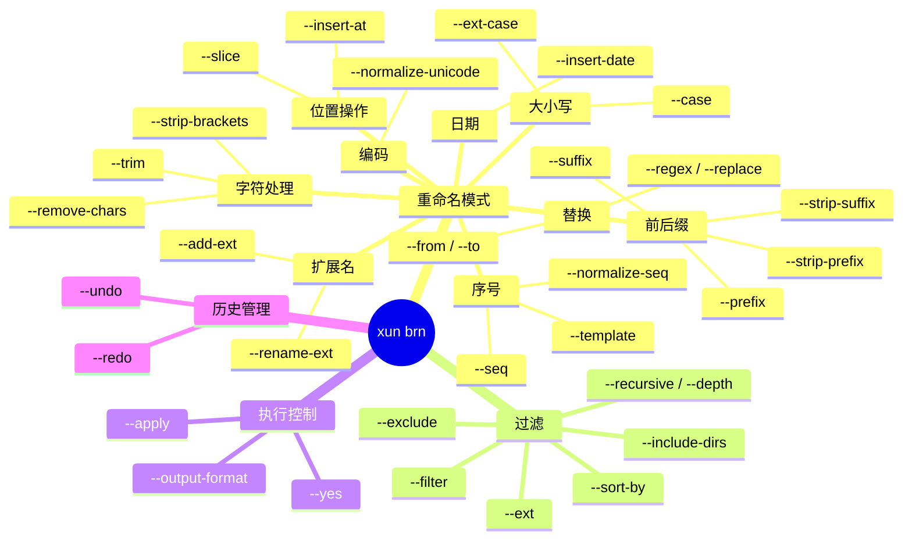

# BRN 模块

> **xun brn** 提供文件批量重命名能力，默认干跑预览，`--apply` 执行，内置 undo/redo 历史管理。

---

## 概述

### 职责边界

| 能力 | 说明 |
|------|------|
| 收集 | 扫描目录，按扩展名/glob/深度过滤，支持递归与排序 |
| 计算 | 20 种重命名模式，支持多步链式管道 |
| 冲突检测 | 自动识别目标冲突、环形依赖，插入中间临时名解环 |
| 预览 | 表格 / JSON / CSV 三种输出格式，dry-run 默认 |
| 执行 | 串行 rename，记录 undo 历史，失败继续并汇总报告 |
| 历史 | NDJSON append-only 双文件 undo/redo 栈，上限 100 步 |

### 前置条件

- **平台**：Windows（依赖 Windows 文件系统语义，NTFS 大小写不敏感）
- **feature gate**：`--features batch_rename`
- **权限**：仅需对目标目录的读写权限，无需管理员

---

## 命令总览

```
xun brn [PATH] [重命名选项] [过滤选项] [--apply] [--undo N] [--redo N]
```



---

## 重命名模式

所有模式**仅作用于文件名主干**（stem），扩展名保持不变，除非显式使用扩展名相关选项。
多个模式可在一条命令中同时指定，按固定顺序依次应用（链式管道）。

### 字符处理

| 选项 | 说明 | 示例 |
|------|------|---------|
| `--trim` | 去除主干首尾空白；`--trim-chars XY` 指定字符集 | `" foo "` → `"foo"` |
| `--remove-chars AB` | 从主干中删除所有指定字符 | `"a.b_c"` + `remove-chars .` → `"ab_c"` |
| `--strip-brackets round` | 删除括号及其内容；可选 `round`/`square`/`curly`/`all`，逗号分隔 | `"foo (1)"` → `"foo "` |

### 替换

| 选项 | 说明 | 示例 |
|------|------|---------|
| `--from A --to B` | 字面替换，所有匹配项 | `"foo_foo"` → `"bar_bar"` |
| `--regex PATTERN --replace REPL` | 正则替换，支持 `$1`/`$2` 捕获组 | `--regex "(\d+)" --replace "[$1]"` |
| `--regex-flags i` | 正则标志：`i`=大小写不敏感，`m`=多行 | |

### 大小写转换

| `--case` 值 | 效果 | 示例 |
|-------------|------|---------|
| `kebab` | kebab-case | `My File` → `my-file` |
| `snake` | snake_case | `My File` → `my_file` |
| `pascal` | PascalCase | `my file` → `MyFile` |
| `upper` | 全大写 | `foo` → `FOO` |
| `lower` | 全小写 | `FOO` → `foo` |

`--ext-case` 对扩展名应用相同转换（如 `.JPG` → `.jpg`）。

### 前后缀

| 选项 | 说明 |
|------|------|
| `--prefix TEXT` | 在主干前插入文本 |
| `--suffix TEXT` | 在主干后（扩展名前）插入文本 |
| `--strip-prefix TEXT` | 删除主干开头的指定前缀（不存在则跳过） |
| `--strip-suffix TEXT` | 删除主干结尾的指定后缀（不存在则跳过） |

### 扩展名

| 选项 | 说明 | 示例 |
|------|------|---------|
| `--rename-ext jpeg:jpg` | 替换扩展名 | `photo.jpeg` → `photo.jpg` |
| `--add-ext txt` | 为无扩展名的文件添加扩展名 | `README` → `README.txt` |

### 位置操作

| 选项 | 说明 | 示例 |
|------|------|---------|
| `--insert-at 3:_v2` | 在主干第 3 个字符处插入；负值从末尾计 | `"photo"` → `"pho_v2to"` |
| `--slice 0:8` | Python 风格切片主干；支持负索引 | `"hello_world"` + `0:5` → `"hello"` |

### 序号

| 选项 | 说明 |
|------|------|
| `--seq` | 在主干后追加零补齐序号（默认从 1 开始，补齐 3 位） |
| `--start N` | 序号起始值（配合 `--seq`） |
| `--pad N` | 零补齐宽度（配合 `--seq`） |
| `--template "{n:03}_{stem}"` | 完全自定义模板，变量：`{stem}` `{ext}` `{n}` `{date}` `{mtime}` |
| `--template-start N` | 模板序号起始值 |
| `--template-pad N` | 模板序号补齐宽度 |
| `--normalize-seq 4` | 将主干末尾数字组补齐到指定位数 | `"ep1"` → `"ep0001"` |

### 日期

| 选项 | 说明 | 示例 |
|------|------|---------|
| `--insert-date prefix:%Y%m%d` | 在主干前/后插入文件日期（mtime），格式为 `prefix\|suffix:strftime` | `"photo"` → `"20240315_photo"` |
| `--ctime` | 使用创建时间代替修改时间（配合 `--insert-date`） | |

### Unicode 规范化

| `--normalize-unicode` 值 | 说明 |
|--------------------------|------|
| `nfc` | 组合形式（推荐，macOS 兼容） |
| `nfd` | 分解形式 |
| `nfkc` | 兼容组合形式 |
| `nfkd` | 兼容分解形式 |

---

## 过滤选项

| 选项 | 说明 | 示例 |
|------|------|---------|
| `--ext jpg png` | 仅处理指定扩展名（可重复） | `--ext jpg --ext png` |
| `--filter "IMG_*"` | 仅处理匹配 glob 的文件名 | |
| `--exclude "*.bak"` | 排除匹配 glob 的文件名 | |
| `-r` / `--recursive` | 递归扫描子目录 | |
| `--depth N` | 最大递归深度（隐含 `--recursive`） | |
| `--include-dirs` | 同时重命名目录（默认仅文件） | |
| `--sort-by name\|mtime\|ctime` | 排序方式，影响序号分配顺序（默认 `name`） | |

---

## 执行控制

| 选项 | 说明 |
|------|------|
| _(无 --apply)_ | dry-run：仅预览，不执行任何 rename |
| `--apply` | 执行实际重命名 |
| `-y` / `--yes` | 跳过确认提示（配合 `--apply`） |
| `--output-format table\|json\|csv` | 预览输出格式（默认 `table`） |

> **最佳实践**：先不加 `--apply` 检查预览，确认无误后加 `--apply -y` 执行。

---

## 历史管理（undo / redo）

```
xun brn PATH --undo [N]   # 撤销最近 N 步（默认 1）
xun brn PATH --redo [N]   # 重做最近 N 步（默认 1）
```

### 历史文件

| 文件 | 说明 |
|------|------|
| `PATH/.xun-brn-undo.log` | undo 栈，NDJSON 格式，每行一个批次 |
| `PATH/.xun-brn-redo.log` | redo 栈，undo 后填充，新操作执行时清空 |

- 每次 `--apply` 执行后自动追加历史，`push_undo` 为 O(1) append，不读现有内容
- undo/redo 栈各自上限 **100 步**，超出时自动丢弃最旧批次
- 旧格式 `.xun-brn-undo.json` 在首次操作时自动迁移，迁移后删除旧文件

### record 语义

```
UndoRecord { from: 重命名后路径, to: 原始路径 }

undo：rename(from → to)   # 还原
redo：rename(to → from)   # 重新执行
```

---

## 冲突与环形依赖处理

| 情况 | 处理方式 |
|------|----------|
| 目标文件已存在（非本次操作来源） | 报告冲突，跳过该文件 |
| A→B、B→A 互换（环形依赖） | 自动插入临时中间名 `__xun_brn_tmp_{idx}__` 解环 |
| 多文件映射到同一目标 | 报告冲突，仅执行第一个 |

---

## 典型用法

```bash
# 预览：将当前目录所有文件名转为 kebab-case
xun brn --case kebab

# 执行：替换空格为下划线，跳过确认
xun brn --from " " --to "_" --apply -y

# 多步链式：先替换空格，再加前缀，再转小写
xun brn --from " " --to "_" --prefix "2024_" --case lower --apply

# 递归处理 jpg/png，文件名前插入 mtime 日期
xun brn ./photos --ext jpg --ext png -r --insert-date prefix:%Y%m%d --apply

# 正则：提取括号内数字，重组文件名
xun brn --regex "(.+?)\s*\((\d+)\)" --replace "$2_$1" --apply

# 序号化：将目录下所有 mp4 按 mtime 排序后编号
xun brn ./videos --ext mp4 --sort-by mtime --seq --start 1 --pad 2 --apply

# 撤销上一次操作
xun brn ./photos --undo

# 撤销最近 3 次操作
xun brn ./photos --undo 3

# 重做上一次撤销
xun brn ./photos --redo
```

---

## 架构

### 执行流水线

```
输入参数（BrnCmd）
    │
    ├─ --undo / --redo → 直接调用 undo/redo，退出
    │
    ▼
 resolve_steps()          # 将 CLI 参数转换为 Vec<RenameMode>
    │
    ▼
 collect_files_depth()    # 扫描目录，过滤，排序 → Vec<PathBuf>
    │
    ▼
 compute_ops_chain()      # 多步链式计算 → Vec<RenameOp { from, to }>
    │
    ▼
 detect_conflicts()       # 冲突检测
    │
    ▼
 break_cycles()           # 解环（插入临时中间名）
    │
    ├─ dry-run → 渲染预览表格 / JSON / CSV，退出
    │
    ▼
 apply_renames()          # 串行 fs::rename，失败继续
    │
    ▼
 push_undo()              # 追加 undo 历史（O(1) append）
```

### 模块结构

```
src/batch_rename/
├── mod.rs               # 模块入口，testing 辅助（集成测试用）
├── compute.rs           # RenameMode（20 种）+ compute_ops + compute_ops_chain
├── collect.rs           # collect_files_depth（rayon 并行子目录 walk）
├── cycle_break.rs       # break_cycles，gen_tmp_name 用环索引
├── conflict.rs          # ConflictInfo / ConflictKind / detect_conflicts
├── conflict_strategy.rs # OnConflict 策略（skip / overwrite / abort）
├── output_format.rs     # ops_to_json（serde_json）+ ops_to_csv
├── preflight.rs         # path_guard 校验
├── types.rs             # CaseStyle / RenameOp
├── natural_sort.rs      # 自然排序
├── ntfs_case.rs         # NTFS 大小写不敏感处理
└── undo.rs              # NDJSON append-only 双文件 undo/redo 历史

src/cli/batch_rename.rs  # argh CLI 参数定义（BrnCmd）
src/commands/batch_rename/
├── mod.rs               # cmd_brn 入口，流水线编排
└── tui.rs               # TUI 交互确认界面
```

### undo 模块内部设计

```
.xun-brn-undo.log   （NDJSON，最后一行 = 最新 batch）
.xun-brn-redo.log

每行格式：
{"ts":1710000000,"ops":[{"from":"b.txt","to":"a.txt"}]}

push_undo：
  1. append 一行到 undo.log（O(1)，不读现有内容）
  2. remove redo.log（清空 redo 栈）
  3. 文件大小粗判（< MAX_HISTORY × 50B 跳过），超出时精确计行，触发 trim

run_undo_steps(n)：
  1. 全量读 undo.log（最多 100 行）
  2. 取末尾 n 个 batch，执行 rename(from → to)
  3. 批量 append_lines 到 redo.log（一次 open → 多次 write）
  4. 重写 undo.log（去掉末尾 n 行）
```

---

## 性能基准

测试环境：Windows 11，NTFS，Divan 100 samples。

| bench | median | 说明 |
|-------|--------|------|
| `compute_single/100` | 71.8 µs | 单步计算，100 文件 |
| `compute_single/1000` | 721.8 µs | 单步计算，1k 文件 |
| `compute_single/10000` | 7.4 ms | 单步计算，10k 文件 |
| `compute_chain_3/100` | 184.3 µs | 3 步链式，100 文件 |
| `compute_chain_3/1000` | 1.85 ms | 3 步链式，1k 文件 |
| `compute_chain_3/10000` | 19.2 ms | 3 步链式，10k 文件 |
| `break_cycles_swaps/50` | 131.7 µs | 50 对互换环解环 |
| `break_cycles_swaps/500` | 1.46 ms | 500 对互换环解环 |
| `undo_push_100` | 17.8 ms | 100 次 push_undo（含文件 I/O） |
| `undo_steps_100` | 20.3 ms | run_undo_steps(100) |
| `redo_steps_100` | 24.1 ms | run_redo_steps(100) |
| `undo_read_history_100` | 108 µs | 读取 100 条历史（纯解析） |

> undo_push_100 的 ~18ms 主要为 Windows NTFS 文件系统调用（CreateFile × 100 + DeleteFile × 100）固有开销，JSON 解析耗时 <1ms。

---

## 错误处理

```
CliError { code: i32, message: String }
├── 路径校验失败        # path_guard 阶段，validate_paths 返回错误
├── 冲突无法解决        # detect_conflicts 发现无法自动处理的冲突
├── rename 失败        # fs::rename 返回非 NotFound 错误（NotFound 静默忽略）
├── undo 文件损坏       # NDJSON 行解析失败
└── undo 栈为空        # --undo 时 undo.log 不存在或为空
```

- rename 执行阶段：单文件失败不中断，累计错误数，最终以非零退出码汇报
- undo/redo 的 rename NotFound：静默忽略（文件已被外部删除时 best-effort 处理）

---

## 注意事项

- `--apply` 执行的 rename 不可通过操作系统撤销，依赖 `--undo` 还原；历史上限 100 步，超出后最旧批次永久丢失。
- `--include-dirs` 重命名目录时，若目录下有子路径也在同批次内，可能导致路径失效；建议先重命名文件再重命名目录。
- `--regex` 使用 Rust `regex` crate 语法，不支持反向引用（`\1`），请使用 `$1`/`$2` 形式。
- NTFS 大小写不敏感：`--case` 转换可能产生「名称相同」的冲突（如 `Foo.txt` → `foo.txt`），工具会自动检测并通过临时名中转。
- undo/redo 历史文件位于**目标目录**（`PATH`）下，不同目录的历史相互独立。