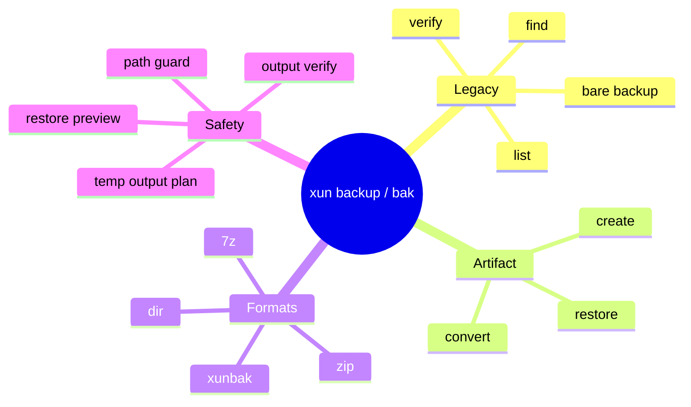
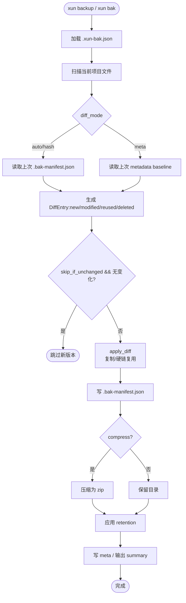
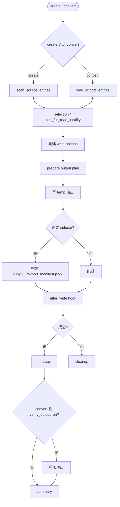
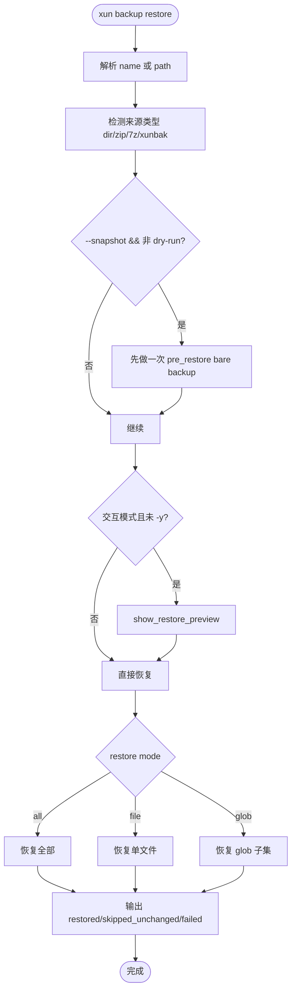

# backup 模块

> **xun backup** / **xun bak** 提供传统目录增量备份与统一备份制品编排能力，覆盖 `create / convert / restore / list / verify / find` 六条显式子命令，并保留兼容的 bare `backup` / `bak` 与 `--container` 入口。

---

## 概述

### 职责边界

| 能力 | 说明 |
|------|------|
| 传统备份 | 以项目目录为源，生成版本化目录备份或可选 `.zip` 结果，支持增量、跳过未变化、保留策略 |
| 制品导出 | 从源目录创建 `dir / zip / 7z / xunbak` 四类备份制品 |
| 制品转换 | 在 `dir / zip / 7z / xunbak` 之间做选择性转换 |
| 恢复 | 从备份名或制品路径恢复全部/单文件/glob 子集 |
| 元数据 | 维护 legacy `.bak-meta.json` / `.bak-manifest.json`，以及新制品 sidecar |
| 校验 | 对 `.xunbak` 源做分级校验，对输出制品做 post-write verify |
| 事务编排 | 所有新制品写入统一走 temp -> write -> finalize/cleanup 事务模型 |

### 分层结构

| 层 | 说明 |
|------|------|
| `backup::legacy` | 传统 `bak` 目录备份链路：扫描、diff、复制、元数据、保留策略 |
| `backup::app` | 命令入口层：`create / convert / restore / xunbak` 编排、summary、progress |
| `backup::artifact` | 制品抽象层：读写 `dir / zip / 7z / xunbak`、sidecar、verify、事务输出计划 |
| `backup::common` | CLI 文案、哈希、路径等公共辅助 |
| `xunbak` | `.xunbak` 容器读写/校验内核，由 backup 模块按 feature gate 集成 |

### 前置条件

- **平台语义**：当前使用场景按 Windows 说明，保留 Windows 文件属性、时间戳与路径安全校验语义。
- **配置文件**：首次执行 bare `backup` / `bak` 或 `backup restore` 时会自动创建 `.xun-bak.json`。
- **feature gate**：`xunbak` 相关的 `create/convert/restore/verify` 依赖 `--features xunbak`。
- **外部 7-Zip**：创建/转换 `7z` 不依赖外部程序；但 `backup convert` 的 7z 输出校验在检测到本机 7-Zip 时会额外执行一次 `7z t`。
- **范围说明**：`xun xunbak plugin ...` 属于插件管理，不属于本文档覆盖范围；本文只描述 backup 组件本身。

---

## 核心概念

### 双轨模型：Legacy 与 Artifact

backup 模块实际维护两条并行但互通的链路：

| 链路 | 入口 | 输出 | 典型用途 |
|------|------|------|------|
| Legacy | `xun backup` / `xun bak`（无子命令） | 版本目录，按配置可再压成 `.zip` | 项目级日常增量备份、保留策略、按版本管理 |
| Artifact | `xun backup create / convert / restore` | `dir / zip / 7z / xunbak` | 面向显式制品的导出、转换、恢复 |

这两条链路并不是互斥关系：

- `backup create --format dir` **且未指定 `-o`** 时，会直接回落到 legacy bare backup。
- `backup restore` 同时支持：
  - legacy 备份名
  - 目录制品路径
  - `.zip`
  - `.7z`
  - `.xunbak`
- `backup convert` 使用统一的 `read_artifact_entries()` 读取上述四类输入，再交给对应 writer 输出。

### SourceEntry：统一输入视图

无论源是文件系统目录、目录备份、zip、7z 还是 `.xunbak`，在 `artifact` 层都会被抽象成统一的 `SourceEntry`：

| 字段 | 含义 |
|------|------|
| `path` | 归一化后的相对路径，统一使用 `/` |
| `size` | 原始字节数 |
| `mtime_ns / created_time_ns` | 文件时间戳 |
| `win_attributes` | Windows 文件属性 |
| `content_hash` | 可选内容哈希提示 |
| `kind` | 来源类型：文件系统、目录制品、zip、7z、xunbak 等 |

这使得 `create` 与 `convert` 能共享相同的排序、选择、写入和 sidecar 构建逻辑。

### Sidecar：制品外显清单

对 `dir / zip / 7z` 三类输出，backup 会默认写入：

| 路径 | 作用 |
|------|------|
| `__xunyu__/export_manifest.json` | 记录导出来源、snapshot_id、每个 entry 的路径/大小/hash/时间戳/属性/codec/packed_size |

sidecar 的定位不是替代主容器格式，而是提供统一的“导出清单视图”：

- `dir` 输出：把目录导出补成可机读的备份制品
- `zip / 7z` 输出：在容器格式之外保留 xun 自身需要的元数据
- `.xunbak` 输出：**不写 sidecar**，因为元数据已经内嵌在 `.xunbak manifest`

### 事务输出计划

`create` 与 `convert` 的所有真实写入都走统一事务模型：

1. `prepare`
2. 写入 temp 路径
3. 可选 `fail-after-write` 测试钩子
4. `finalize`
5. 出错则 `cleanup`

对应的输出计划类型包括：

| 类型 | 目标 |
|------|------|
| `DirOutputPlan` | 目录输出 |
| `ZipOutputPlan` | 单文件 zip |
| `SevenZOutputPlan` | 单文件 7z |
| `SevenZSplitOutputPlan` | 分卷 7z |
| `XunbakOutputPlan` | 单文件 `.xunbak` |
| `XunbakSplitOutputPlan` | 分卷 `.xunbak` |
| `XunbakSingleUpdatePlan` / `XunbakSplitUpdatePlan` | 现有 `.xunbak` 更新时的 staged commit / rollback |

因此 `create` / `convert` 的错误语义是一致的：写失败不发布目标，阶段失败清理 temp，更新失败尽量回滚原结果。

---

## 配置与内部文件

### 配置文件

配置文件位于项目根目录：`.xun-bak.json`

若只存在旧文件名 `.svconfig.json`，会自动迁移到新名字。

| 键名 | 类型 | 默认值 | 说明 |
|------|------|--------|------|
| `storage.backupsDir` | `String` | `A_backups` | legacy 备份目录 |
| `storage.compress` | `bool` | `true` | bare `backup` 完成后是否再压成 zip |
| `naming.prefix` | `String` | `v` | 版本前缀 |
| `naming.dateFormat` | `String` | `yyyy-MM-dd_HHmm` | 版本时间格式 |
| `naming.defaultDesc` | `String` | `backup` | 默认描述 |
| `retention.maxBackups` | `usize` | `50` | 最多保留多少份 |
| `retention.deleteCount` | `usize` | `10` | 一次清理多少份 |
| `retention.keepDaily` | `usize` | `0` | 每日保留窗口 |
| `retention.keepWeekly` | `usize` | `0` | 每周保留窗口 |
| `retention.keepMonthly` | `usize` | `0` | 每月保留窗口 |
| `include` | `Vec<String>` | 内置默认列表 | bare backup / `create` 扫描来源 |
| `exclude` | `Vec<String>` | 内置默认列表 | bare backup / `create` 排除规则 |
| `useGitignore` | `bool` | `false` | bare backup 额外读取 `.gitignore` |
| `skipIfUnchanged` | `bool` | `false` | 无变化时跳过新版本 |

### 内部文件

| 文件 | 作用域 | 作用 |
|------|------|------|
| `.xun-bak.json` | 项目根 | backup 配置 |
| `.xun-bak-hash-cache.json` | 项目根 | bare backup 扫描阶段的哈希缓存 |
| `.bak-meta.json` | legacy 目录备份根 | 人类/程序可读的备份元信息 |
| `.bak-manifest.json` | legacy 目录备份根 | 内容哈希清单，给 hash diff / verify / restore 使用 |
| `<backup>.meta.json` | legacy zip 旁路文件 | bare backup 压成 zip 后的 meta 旁挂文件 |
| `__xunyu__/export_manifest.json` | `dir / zip / 7z` 制品内 | 新制品统一 sidecar |

### Legacy 与新制品的内部文件差异

| 输出路径 | 内部文件策略 |
|------|------|
| bare `backup` 目录结果 | 写 `.bak-meta.json` + `.bak-manifest.json` |
| bare `backup` zip 结果 | `.bak-manifest.json` 在压缩前目录中生成；meta 写到 zip 同名旁路 `.meta.json` |
| `backup create --format dir` | 不写 `.bak-*`，只在默认情况下写 sidecar |
| `backup create --format zip / 7z` | 不写 `.bak-*`，在容器内写 sidecar |
| `backup create --format xunbak` | 不写 sidecar，全部信息进入 `.xunbak manifest` |

---

## 格式能力矩阵

### 目标格式能力

| 格式 | create | convert 目标 | restore 来源 | split | sidecar | 编码/方法 |
|------|------|------|------|------|------|------|
| `dir` | 是 | 是 | 是 | 否 | 默认开启 | 无压缩 |
| `zip` | 是 | 是 | 是 | 否 | 默认开启 | `stored / deflated / bzip2 / zstd / ppmd / auto` |
| `7z` | 是 | 是 | 是 | 是 | 默认开启 | `copy / lzma2 / bzip2 / deflate / ppmd / zstd` |
| `xunbak` | 是 | 是 | 是 | 是 | 不使用 | `none / zstd / zstd:N / auto / lz4 / ppmd / lzma2 / deflate / bzip2` |

### 参数边界

| 能力 | `dir` | `zip` | `7z` | `xunbak` |
|------|------|------|------|------|
| `--split-size` | 不支持 | 不支持 | 支持 | 支持 |
| `--solid` | 不支持 | 不支持 | 支持 | 不支持 |
| `--method`（create） | 不支持 | 支持 | 支持 | 不支持，create 用 `--compression` |
| `--method`（convert） | 不支持 | 支持 | 支持 | 支持，但语义是 xunbak 压缩 profile |
| `--level` | 不支持 | 支持 | 支持 | create 不支持；convert 仅用于 `zstd:N` override |
| `--threads` | 不支持 | 不支持 | 当前不支持 | 当前不支持 |
| `--password / --encrypt-header` | 不支持 | 不支持 | 当前不支持 | 当前不支持 |

> **注意**
>
> - `backup create --format xunbak` 使用 `--compression`
> - `backup convert --format xunbak` 使用 `--method`
>
> 这是一层兼容性折中，不是两个完全独立的编码系统。

---

## 命令总览



---

## 关键流程

### Legacy bare backup 流程



### 新制品 create / convert 流程



### restore 流程



---

## 命令详解

### `xun backup` / `xun bak` — 传统目录增量备份

```
xun backup [-C DIR] [-m DESC] [--incremental] [--skip-if-unchanged] [--diff-mode auto|hash|meta] [--no-compress] [--retain N] [--json]
xun bak ...
```

这是 backup 模块的传统入口，特点是：

- 自动使用 `.xun-bak.json` 的 include/exclude 规则
- 自动分配版本号与备份目录名
- 支持 hash diff、hardlink 复用、保留策略
- 输出结果是：
  - 目录备份
  - 或按配置额外压成 `.zip`

| 参数 | 说明 |
|------|------|
| `-C <dir>` | 项目根目录 |
| `-m <desc>` | 备份描述 |
| `--incremental` | 只写新/改/复用文件，不再强制全量复制 |
| `--skip-if-unchanged` | 无变化则不创建新版本 |
| `--diff-mode auto|hash|meta` | baseline 策略；默认 `auto` |
| `--no-compress` | 保留目录，不再压 zip |
| `--retain N` | 覆盖 retention 的最大保留数 |
| `--json` | 输出结构化 summary |
| `--container out.xunbak` | 兼容入口，直接走 `.xunbak` 写入/update 流程 |

#### `diff_mode` 语义

| 模式 | 行为 |
|------|------|
| `auto` | 优先读取上次 `.bak-manifest.json` 做 hash diff；缺失时退化为 fresh full |
| `hash` | 强制要求上次 `.bak-manifest.json` 存在 |
| `meta` | 用 size/mtime metadata 做 diff；真正写入前会再补 hash 清单 |

#### 产出语义

| 统计字段 | 含义 |
|------|------|
| `new` | 新文件 |
| `modified` | 修改文件 |
| `reused` | 可复用内容（含 rename-only） |
| `deleted` | 从 baseline 删除的路径 |
| `hardlinked_files` | 实际通过硬链接复用的文件数 |
| `hash_cache_hits` | 命中 `.xun-bak-hash-cache.json` 的文件数 |

**示例：**

```bash
# 传统增量备份
xun bak -C D:\Repo -m "before refactor" --incremental

# 无变化则跳过
xun bak --skip-if-unchanged --json

# 强制只保留目录，不压 zip
xun backup --no-compress

# 兼容入口：直接写 xunbak
xun backup -C D:\Repo --container D:\out\repo.xunbak --compression auto
```

---

### `xun backup create` — 从源目录创建新制品

```
xun backup create -C <source> --format dir|zip|7z|xunbak -o <output> [选项]
```

| 参数 | 说明 |
|------|------|
| `-C <dir>` | 源目录，默认 cwd |
| `--format` | `dir / zip / 7z / xunbak` |
| `-o <path>` | 输出路径；非 `dir` 格式必须显式提供 |
| `--include / --exclude` | 追加扫描规则，和 `.xun-bak.json` 合并 |
| `--list` | 仅列出将被导出的条目 |
| `--dry-run` | 不写输出 |
| `--progress auto|always|off` | 进度显示策略 |
| `--no-sidecar` | 对 `dir / zip / 7z` 禁用 sidecar |
| `--no-compress` | 强制使用无压缩路径 |
| `--method` | `zip / 7z` 输出方法 |
| `--compression` | `xunbak` 压缩 profile |
| `--split-size` | `7z / xunbak` 分卷 |
| `--solid` | 仅 7z 支持 |

#### 特殊分支

- `--format dir` 且 **没有 `-o`**：回落到 legacy bare backup
- `--format dir` 且 **有 `-o`**：走 artifact 目录导出，不再生成 legacy `.bak-*`

**示例：**

```bash
# 导出 zip
xun backup create -C D:\Repo --format zip -o D:\out\repo.zip

# 导出分卷 7z
xun backup create -C D:\Repo --format 7z -o D:\out\repo.7z --split-size 2G --method lzma2

# 导出 xunbak
xun backup create -C D:\Repo --format xunbak -o D:\out\repo.xunbak --compression auto

# 只看选中项
xun backup create -C D:\Repo --format zip -o D:\out\repo.zip --list --json
```

---

### `xun backup convert` — 制品之间转换

```
xun backup convert <artifact> --format dir|zip|7z|xunbak -o <output> [选项]
```

`convert` 的输入源可以是：

- 目录备份
- `.zip`
- `.7z`
- `.xunbak`

它会先统一读取为 `SourceEntry`，再做选择、排序、写入和可选 verify。

| 参数 | 说明 |
|------|------|
| `<artifact>` | 输入制品路径 |
| `--format` | 目标格式 |
| `-o <path>` | 目标路径 |
| `--file` | 选择单个相对路径，可重复 |
| `--glob` | 选择 glob，可重复 |
| `--patterns-from` | 从文件加载 glob 规则 |
| `--overwrite ask|replace|fail` | 输出覆盖策略 |
| `--verify-source` | `quick / full / manifest-only / existence-only / paranoid / off` |
| `--verify-output on|off` | post-write 校验 |
| `--split-size` | `7z / xunbak` 分卷 |
| `--method` | 目标编码方法；对 xunbak 来说是 compression profile |
| `--level` | 压缩级别 |
| `--no-sidecar` | 禁用 `dir / zip / 7z` sidecar |
| `--list / --dry-run / --json / --progress` | 预览与输出控制 |

#### 校验语义

| 场景 | 行为 |
|------|------|
| `verify_source` | 仅对 `.xunbak` 输入真正执行分级校验；其他输入直接放行 |
| `verify_output=on` + `zip` | 校验 entry 内容；若包含 PPMD，再走手工 PPMD 校验 |
| `verify_output=on` + `7z` | 读取 7z entry 并校验内容；若检测到外部 7-Zip，再额外执行 `7z t` |
| `verify_output=on` + `xunbak` | 执行 quick verify |
| `verify_output=on` + `dir` | 当前不做额外 verify |

**示例：**

```bash
# 从 zip 转成 7z
xun backup convert D:\in\repo.zip --format 7z -o D:\out\repo.7z --method zstd

# 从 xunbak 转成目录，只恢复 src 下的 rs 文件
xun backup convert D:\in\repo.xunbak --format dir -o D:\out\restore --glob "src/**/*.rs"

# 关闭源校验，保留输出校验
xun backup convert D:\in\repo.xunbak --format zip -o D:\out\repo.zip --verify-source off
```

---

### `xun backup restore` — 从制品恢复

```
xun backup restore <name-or-path> [--file REL | --glob PATTERN] [--to DIR] [--snapshot] [--dry-run] [-y] [--json]
```

`restore` 是 backup 组件的统一恢复入口：

- 如果参数是现有路径，直接按制品路径处理
- 如果不是路径，则去 `A_backups` 中按备份名解析

| 参数 | 说明 |
|------|------|
| `<name-or-path>` | 备份名或制品路径 |
| `--file <rel>` | 恢复单文件 |
| `--glob <pattern>` | 恢复 glob 子集 |
| `--to <dir>` | 恢复到指定目录 |
| `--snapshot` | 恢复前先做一次 `pre_restore` bare backup |
| `--dry-run` | 只展示将恢复的内容 |
| `-y` | 跳过确认 |
| `--json` | 输出结构化摘要 |

#### 行为差异

| 来源 | 恢复实现 |
|------|------|
| `dir` | `restore_core` 直接复制目录文件，自动跳过 `.bak-*` 内部文件 |
| `zip` | `restore_core` 读取 zip entry |
| `7z` | `backup::artifact::sevenz` 读取 7z entry |
| `xunbak` | `ContainerReader` 恢复，支持未变化跳过与批量顺序优化 |

#### 安全策略

- `--file` 只接受相对路径，拒绝绝对路径和 `..`
- 恢复前预览会区分 `overwrite / new`
- `restore_core` 会过滤 `.bak-meta.json` 与 `.bak-manifest.json`
- `.xunbak restore_all` 会统计 `skipped_unchanged`

**示例：**

```bash
# 从备份名恢复全部
xun backup restore v12-before_release

# 从 zip 恢复单文件到其他目录
xun backup restore D:\out\repo.zip --file src/main.rs --to D:\tmp\restore

# dry-run 查看将被覆盖的文件
xun backup restore D:\out\repo.xunbak --glob "docs/**/*.md" --dry-run

# 恢复前先做一次快照
xun backup restore v15-bad_migration --snapshot
```

---

### `xun backup list` / `verify` / `find` — Legacy 库存命令

这三条命令操作的是 **legacy 备份目录**，而不是任意 artifact 路径。

#### `xun backup list`

```
xun backup list [--json]
```

列出 `A_backups` 下可识别的 legacy 备份。

#### `xun backup verify`

```
xun backup verify <backup-name> [--json]
```

校验 legacy 目录备份的完整性，依赖 `.bak-manifest.json`。

#### `xun backup find`

```
xun backup find [tag] [--since TIME] [--until TIME] [--json]
```

按 tag 与时间窗口筛选 legacy 备份元数据。

> 如果你需要校验 `.xunbak` 本体，请使用 `xun verify` 或 `backup convert --verify-source ...`，而不是 `backup verify`。

---

## 典型用法

```bash
# 1. 日常项目增量备份
xun bak -C D:\Repo -m "before merge" --incremental --skip-if-unchanged

# 2. 显式导出 zip 制品
xun backup create -C D:\Repo --format zip -o D:\Artifacts\repo.zip

# 3. 从 zip 转成 xunbak
xun backup convert D:\Artifacts\repo.zip --format xunbak -o D:\Artifacts\repo.xunbak --method auto

# 4. 从 xunbak 恢复 docs 子集
xun backup restore D:\Artifacts\repo.xunbak --glob "docs/**/*.md" --to D:\Restore

# 5. 只列出 create 将要导出的文件
xun backup create -C D:\Repo --format 7z -o D:\Artifacts\repo.7z --list

# 6. 转换前做 full source verify
xun backup convert D:\Artifacts\repo.xunbak --format zip -o D:\Artifacts\repo.zip --verify-source full
```

---

## 实现特点

### 性能方向

| 场景 | 当前策略 |
|------|------|
| bare backup 扫描 | 维护 `.xun-bak-hash-cache.json`，降低重复哈希成本 |
| bare backup 复用 | 对 `reused` 内容优先走硬链接复用 |
| `convert` 读取 | 对选中条目做 `sort_for_read_locality`，优化多文件读取顺序 |
| sidecar | 尽量复用写入阶段已得到的 content hash，避免额外读全量内容 |
| `.xunbak restore_all` | 按 workload 自适应并行，保持 volume + offset locality |

### 可维护性方向

| 设计点 | 价值 |
|------|------|
| `BackupCreateOptions / BackupConvertOptions / BackupRestoreOptions` | 把 CLI 参数解析和业务校验集中化 |
| `SummaryActionStatus / SummaryPaths / SummaryExecutionStats` | 统一 JSON summary 结构 |
| `TransactionalOutputPlan` | 抽平 create/convert 的写入事务语义 |
| `SourceEntry` + `read_artifact_entries()` | 将格式差异收敛到入口层，减轻上层分支复杂度 |

---

## 使用建议

- 想保留版本语义、差异统计和 retention：优先用 bare `xun bak`
- 想得到显式制品：用 `backup create`
- 已有制品之间做格式转换：用 `backup convert`
- 恢复时优先先跑一次 `--dry-run`
- 只在确实接受跳过完整性检查时才把 `--verify-source` 调成 `off`
- 对 `7z / xunbak` 大文件场景优先显式指定输出路径，避免把产物写回源目录附近造成混淆

