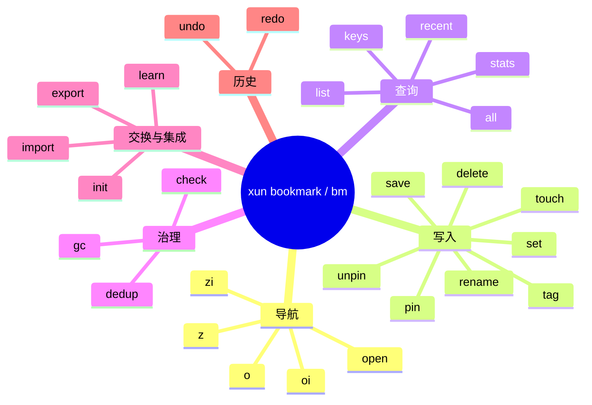

# bookmark 模块

> **xun bookmark** / **bm** 提供目录书签、自动学习、统一查询与 Shell 集成能力，覆盖 `z / zi / o / oi / open / save / set / delete / tag / pin / unpin / undo / redo / rename / list / recent / stats / check / gc / dedup / export / import / init / learn / touch / keys / all` 共 27 条子命令。

---

## 概述

### 受众与阅读建议

本文档面向使用 xun CLI 的开发者。建议先阅读「前置条件」和「快速入门」，再按需查阅「命令详解」。

### 职责边界

| 能力 | 说明 |
|------|------|
| 显式书签 | 将目录保存为命名书签，支持标签、描述、workspace、pin |
| 自动学习 | 根据目录切换行为积累 learned 记录 |
| 统一查询 | `z / zi / o / oi / open` 共用一套查询与排序核心 |
| 书签治理 | 通过 `check / gc / dedup` 检查死链、陈旧记录与重复项 |
| 数据交换 | 支持原生 `json / tsv` 导入导出，也支持从 `autojump / zoxide / z / fasd / history` 导入 |
| Shell 集成 | 通过 `init` 生成 PowerShell、pwsh、bash、zsh、fish 初始化脚本 |
| 历史回滚 | 通过 `undo / redo` 回滚最近 mutation batch，粒度为差异批次 |

### 分层结构

| 层 | 说明 |
|------|------|
| `bookmark::cli_namespace` / `bookmark::cli_commands` | 命令面定义，解析 `xun bookmark <sub>` 与 `bm <sub>` |
| `bookmark::commands` | 导航、写入、查询、维护、导入导出、undo/redo 的业务编排 |
| `bookmark::query + bookmark::core` | 统一查询内核，负责召回、匹配、scope、排序与解释 |
| `bookmark::state` | 书签领域模型与 Store，负责 load/save、元数据更新、运行时 aging 与索引失效 |
| `bookmark::cache + bookmark::index` | binary cache 与嵌入索引，用于 fast-load 与 prefix recall |
| `bookmark::undo` | delta-based undo/redo 日志模型 |

### 前置条件

| 项目 | 说明 |
|------|------|
| 平台 | Windows-only；`o / open` 通过 `explorer.exe` 或 `cmd /C start` 打开目标 |
| feature gate | 无需额外 feature flag，随主二进制编译 |
| 权限 | 普通用户权限即可；`delete --on-reboot` 需要管理员权限 |
| 初始化 | Shell 跳转前必须执行 `xun bookmark init <shell>` 并将输出脚本加载进对应 profile |

---

## 快速入门

1. 生成 PowerShell 集成脚本并加载：

```bash
xun bookmark init powershell >> $PROFILE
. $PROFILE
```

**预期输出**：终端重新加载后 `z`、`zi`、`o`、`oi`、`bm` 函数可用。

2. 保存当前目录为书签：

```bash
bm save myproject
```

**预期输出**：

```
✅ Saved bookmark 'myproject' -> D:/repo/myproject
```

3. 模糊跳转到书签：

```bash
bm z myproject
```

**预期输出**：Shell 切换到 `D:/repo/myproject`。

4. 查看所有书签：

```bash
bm list
```

**预期输出**：

```
NAME        PATH                    VISITS  LAST VISITED
myproject   D:/repo/myproject       1       2026-04-04
```

5. 检查书签健康状态：

```bash
bm check
```

**预期输出**（无问题时）：

```
Check OK: no issues found.
```

---

## 核心概念

### 记录来源

bookmark 运行时有三类来源：

| 来源 | 含义 | 典型入口 | 排序倾向 |
|------|------|------|------|
| `Explicit` | 用户显式维护的正式书签 | `save / set / import(json/tsv)` | 最高 |
| `Imported` | 从外部生态导入的候选路径 | `import --from ...` | 中 |
| `Learned` | 根据目录访问行为自动学习得到的路径 | `learn` 或 shell hook | 最低 |

同等匹配条件下：`Explicit` 优先于 `Imported`，`Imported` 优先于 `Learned`，`pinned` 会进一步提升排序权重。

### 数据模型

`Store` 中的单条书签记录包含以下关键字段：

| 字段 | 说明 |
|------|------|
| `id` | 记录唯一标识，用于 undo/redo 与 dedup 合并 |
| `name` | 显式书签名称；learned/imported 记录可能为空 |
| `name_norm` | 归一化名称，用于大小写不敏感匹配 |
| `path` | 展示与执行使用的标准化路径 |
| `path_norm` | 比较键，用于去重、scope 判断和大小写不敏感匹配 |
| `source` | `Explicit / Imported / Learned` |
| `pinned` | 是否置顶 |
| `tags` | 标签列表，大小写不敏感去重 |
| `desc` | 描述信息 |
| `workspace` | 逻辑工作域标签 |
| `created_at` | 创建时间戳 |
| `last_visited` | 最近访问时间 |
| `visit_count` | 访问次数 |
| `frecency_score` | frecency 种子分值 |

### 路径与名称归一化

bookmark 在写入和查询时先做归一化，再存储或比较：

| 归一化项 | 行为 |
|------|------|
| 名称 | `trim + to_ascii_lowercase`，用于大小写不敏感名称匹配 |
| 路径分隔符 | 统一转成 `/` |
| 相对路径 | `set` 写入时会按当前 cwd 解析为绝对路径 |
| `~` | 支持展开到用户主目录 |
| UNC | 会校验 `\\server\share` 这类路径的合法性 |
| symlink | 若 `resolveSymlinks=true`，会尝试 `canonicalize` 后再归一化 |

### Scope 与 Workspace

查询范围由 `QueryScope` 控制：

| Scope | 说明 | 典型参数 |
|------|------|------|
| `Auto` | 默认模式；同时考虑当前 cwd、父子路径关系，以及从 cwd 推导出的 workspace 上下文 | 默认 |
| `Global` | 不做目录域限制，按全局排序 | `-g` |
| `Child` | 偏向当前目录及其子目录 | `-c` |
| `BaseDir` | 只在某个基准目录下检索 | `--base D:/repo` |
| `Workspace` | 只匹配 `workspace` 标签完全相同的书签 | `-w xunyu` |

`workspace` 是挂在书签上的逻辑标签，不是路径，也不是 IDE 工作区对象。在 `Auto` 模式下，如果当前 cwd 落在某个带 `workspace` 的显式书签路径之下，查询上下文会自动继承这个 `workspace`。

### 访问统计与 Frecency

bookmark 把"最近是否访问过"和"访问是否频繁"一起纳入排序：

| 因子 | 说明 |
|------|------|
| `visit_count` | 访问次数 |
| `last_visited` | 最近访问时间 |
| `frecency_score` | 预填充分值或 aging 后的存量分值 |

高频访问、最近访问、已 pinned、来源更正式、scope 更贴近当前上下文的书签，会更容易出现在 top-1。

### 统一查询内核

`z / zi / o / oi / open / completion` 都走同一套 query core，主要排序因子如下：

| 因子 | 作用 |
|------|------|
| `match_score` | 关键词对 `name / basename / path segment / tag` 的命中质量 |
| `frecency_mult` | 访问频率与最近访问时间带来的倍率 |
| `scope_mult` | cwd、父子路径、workspace、base dir 带来的范围倍率 |
| `source_mult` | `Explicit / Imported / Learned` 来源倍率 |
| `pin_mult` | pinned 书签额外倍率 |

---

## 命令总览

bookmark 的 27 条子命令按功能分为六组，如下图所示：



**图表解读**：

- 导航类（`z / zi / o / oi / open`）共用同一套 query core，入口位于 `src/bookmark/commands/navigation.rs`
- 写入类操作均会记录 undo batch，支持通过 `undo / redo` 回滚
- 治理类（`check / gc / dedup`）不带破坏性参数时只输出报告，不修改数据
- `init / learn` 是 Shell 集成的两个端点：`init` 生成脚本，`learn` 接收 hook 写入

---

## 命令详解

### `bm z`

模糊匹配书签并跳转到 top-1 目录。

```bash
bm z api
```

**默认行为**：不带任何参数时，输出 `No matches found.`（无关键词无法匹配）。

#### 查询参数

| 参数 | 类型 | 默认值 | 说明 |
|------|------|--------|------|
| `patterns` | string... | — | 模糊关键词，支持多 token AND 匹配 |
| `-t <tag>` | string | — | 按标签过滤 |
| `--preset <name>` | string | — | 使用配置预设 |

#### 输出参数

| 参数 | 类型 | 默认值 | 说明 |
|------|------|--------|------|
| `-l` | bool | false | 列表模式，不执行跳转 |
| `-s` | bool | false | 输出各项评分因子 |
| `--why` | bool | false | 解释 top-1 为什么胜出 |
| `--preview` | bool | false | 只预览，不执行跳转 |
| `-n <N>` | usize | — | 限制结果数 |
| `--json` | bool | false | JSON 输出 |
| `--tsv` | bool | false | TSV 输出 |

#### 范围参数

| 参数 | 类型 | 默认值 | 说明 |
|------|------|--------|------|
| `-g` | bool | false | 强制全局范围 |
| `-c` | bool | false | 偏向当前目录及其子目录 |
| `--base <path>` | string | — | 限定基准目录 |
| `-w <workspace>` | string | — | 只在指定 workspace 内匹配 |

> **参数约束**：`--json` 与 `--tsv` 互斥；`-g / -c / --base / -w` 互斥，只能指定一种范围。

**用例 1：跳转到最匹配的项目目录**

```bash
bm z api
```

**预期输出**：

```
__BM_CD__ D:/repo/xunyu/client-api
```

Shell wrapper 接收信号后执行目录切换。

**用例 2：查看候选列表与评分，不执行跳转**

```bash
bm z api -l -s
```

**预期输出**：

```
SCORE   NAME        PATH
0.92    client-api  D:/repo/xunyu/client-api
0.61    api-docs    D:/repo/xunyu/api-docs
```

**常见问题**：若报 `No matches found.`，先用 `-l -s` 查看候选；必要时加 `-g` 放大范围，或去掉 `-t / -w` 过滤。

#### 参数组合速查

| 组合 | 效果 |
|------|------|
| `bm z api` | 跳转到最匹配 api 的书签 |
| `bm z api -l` | 列出候选，不跳转 |
| `bm z api -l -s` | 列出候选并显示评分 |
| `bm z api --why` | 解释 top-1 胜出原因 |
| `bm z api -g` | 全局范围匹配 |
| `bm z api -w xunyu` | 只在 xunyu workspace 内匹配 |
| `bm z api -t rust` | 按标签 rust 过滤后匹配 |
| `bm z api --json` | JSON 输出候选列表 |
| `bm z api -n 5` | 限制候选数为 5 |

---

### `bm zi`

模糊匹配书签并通过交互选择后跳转。

```bash
bm zi repo
```

**默认行为**：进入交互选择界面；若当前环境不可交互，自动退回 top-1。

参数与 `bm z` 完全相同，参见上节参数表格。

**用例 1：交互选择后跳转**

```bash
bm zi repo
```

**预期输出**：弹出 fzf 交互界面，选中后 Shell 切换到对应目录。

**用例 2：在 CI 等非交互环境中退回 top-1**

```bash
bm zi repo
```

**预期输出**（非交互环境）：

```
__BM_CD__ D:/repo/xunyu
```

**常见问题**：若 fzf 未安装，交互模式会降级为 top-1 直达。

#### 参数组合速查

| 组合 | 效果 |
|------|------|
| `bm zi repo` | 交互选择后跳转 |
| `bm zi repo -w xunyu` | 只在 xunyu workspace 内交互选择 |
| `bm zi repo -t rust` | 按标签过滤后交互选择 |
| `bm zi repo -l` | 列出候选，不进入交互 |
| `bm zi repo --json` | JSON 输出候选，不执行跳转 |

---

### `bm o` / `bm open`

模糊匹配书签并用文件管理器打开目标目录。

```bash
bm o docs
```

**默认行为**：不带任何参数时，直接打开当前目录（`explorer.exe .`）。

参数与 `bm z` 完全相同，参见 `bm z` 参数表格。`bm open` 与 `bm o` 等价。

**用例 1：打开指定书签目录**

```bash
bm o docs
```

**预期输出**：Windows 资源管理器打开 `D:/repo/xunyu/docs`。

**用例 2：无参数直接打开当前目录**

```bash
bm o
```

**预期输出**：Windows 资源管理器打开当前工作目录。

**常见问题**：对文件路径走 `cmd /C start`，对目录路径走 `explorer.exe`。

#### 参数组合速查

| 组合 | 效果 |
|------|------|
| `bm o` | 打开当前目录 |
| `bm o docs` | 打开最匹配 docs 的书签目录 |
| `bm o docs -w xunyu` | 只在 xunyu workspace 内匹配后打开 |
| `bm o docs -l` | 列出候选，不打开 |
| `bm o docs --why` | 解释 top-1 胜出原因 |

---

### `bm oi`

模糊匹配书签并通过交互选择后打开目录。

```bash
bm oi repo
```

**默认行为**：进入交互选择界面；若当前环境不可交互，自动退回 top-1 并打开。

参数与 `bm z` 完全相同，参见 `bm z` 参数表格。

**用例 1：交互选择后打开**

```bash
bm oi repo
```

**预期输出**：弹出 fzf 交互界面，选中后资源管理器打开对应目录。

**用例 2：按标签过滤后交互选择**

```bash
bm oi -t frontend
```

**预期输出**：只展示带 `frontend` 标签的书签供选择。

**常见问题**：与 `bm zi` 的区别仅在于执行动作是"打开"而非"跳转"。

#### 参数组合速查

| 组合 | 效果 |
|------|------|
| `bm oi repo` | 交互选择后打开 |
| `bm oi -t frontend` | 按标签过滤后交互选择打开 |
| `bm oi repo -w xunyu` | 只在 xunyu workspace 内交互选择 |
| `bm oi repo -l` | 列出候选，不进入交互 |

---

### `bm save`

将当前目录保存为显式书签。

```bash
bm save myproject
```

**默认行为**：不带 `name` 时，使用当前目录名作为书签名称。

| 参数 | 类型 | 默认值 | 说明 |
|------|------|--------|------|
| `name` | string | 当前目录名 | 书签名称（可选） |
| `-t <tags>` | string | — | 逗号分隔的标签列表 |
| `--desc <text>` | string | — | 书签描述 |
| `-w <workspace>` | string | — | 逻辑工作域标签 |

**用例 1：保存当前目录并附加标签和 workspace**

```bash
bm save api -t rust,core --desc "主 API 仓库" -w xunyu
```

**预期输出**：

```
✅ Saved bookmark 'api' -> D:/repo/xunyu/client-api
```

**用例 2：同名书签已存在时强制覆盖已存在的旧配置**

```bash
bm save api -t rust,core,backend
```

**预期输出**：

```
✅ Updated bookmark 'api' -> D:/repo/xunyu/client-api
```

同名显式书签已存在时执行更新，不报冲突。

**常见问题**：`save` 只保存当前目录；若要保存任意路径，使用 `bm set`。

#### 参数组合速查

| 组合 | 效果 |
|------|------|
| `bm save` | 以当前目录名保存当前目录 |
| `bm save api` | 以名称 api 保存当前目录 |
| `bm save api -t rust` | 保存并附加标签 |
| `bm save api -w xunyu` | 保存并设置 workspace |
| `bm save api -t rust -w xunyu --desc "API 仓库"` | 保存并附加全部元数据 |

---

### `bm set`

为指定路径创建或更新显式书签。

```bash
bm set web D:/repo/xunyu/client-web
```

**默认行为**：省略 `path` 时保存当前目录，等同于 `bm save <name>`。

| 参数 | 类型 | 默认值 | 说明 |
|------|------|--------|------|
| `name` | string | — | 书签名称（必填） |
| `path` | string | 当前目录 | 目标路径（可选） |
| `-t <tags>` | string | — | 逗号分隔的标签列表 |
| `--desc <text>` | string | — | 书签描述 |
| `-w <workspace>` | string | — | 逻辑工作域标签 |

**用例 1：为不在当前目录的路径建书签**

```bash
bm set web D:/repo/xunyu/client-web -t frontend -w xunyu
```

**预期输出**：

```
✅ Saved bookmark 'web' -> D:/repo/xunyu/client-web
```

**用例 2：路径不存在时仍可写入（带 warning）**

```bash
bm set future D:/repo/xunyu/new-service
```

**预期输出**：

```
⚠ Path does not exist: D:/repo/xunyu/new-service
✅ Saved bookmark 'future' -> D:/repo/xunyu/new-service
```

**常见问题**：相对路径会按当前 cwd 解析为绝对路径后写入。

#### 参数组合速查

| 组合 | 效果 |
|------|------|
| `bm set api` | 以当前目录创建书签 api |
| `bm set api D:/repo/api` | 为指定路径创建书签 |
| `bm set api D:/repo/api -t rust` | 创建书签并附加标签 |
| `bm set api D:/repo/api -w xunyu` | 创建书签并设置 workspace |

---

### `bm rename`

重命名显式书签。

```bash
bm rename api client-api
```

**默认行为**：`old == new` 时只输出 warning，不写盘。

| 参数 | 类型 | 默认值 | 说明 |
|------|------|--------|------|
| `old` | string | — | 原书签名称（必填） |
| `new` | string | — | 新书签名称（必填） |

**用例 1：正常重命名**

```bash
bm rename api client-api
```

**预期输出**：

```
✅ Renamed 'api' -> 'client-api'
```

**用例 2：新名称已存在时报错**

```bash
bm rename api web
```

**预期输出**：

```
Error: bookmark 'web' already exists.
```

**常见问题**：`rename` 只对显式书签生效，learned/imported 记录无法重命名。

#### 参数组合速查

| 组合 | 效果 |
|------|------|
| `bm rename api client-api` | 将书签 api 重命名为 client-api |

---

### `bm delete`

删除显式书签。

```bash
bm delete old-project -y
```

**默认行为**：交互终端下提示二次确认；`-y` 跳过确认。

| 参数 | 类型 | 默认值 | 说明 |
|------|------|--------|------|
| `name` | string | — | 书签名称（必填） |
| `-y` | bool | false | 跳过确认 |

**用例 1：交互确认后删除**

```bash
bm delete old-project
```

**预期输出**：

```
Delete bookmark 'old-project'? [y/N] y
✅ Deleted bookmark 'old-project'
```

**用例 2：脚本中跳过确认直接删除**

```bash
bm delete old-project -y
```

**预期输出**：

```
✅ Deleted bookmark 'old-project'
```

**常见问题**：若报 `not found`，先用 `bm keys` 确认书签名称是否存在。

#### 参数组合速查

| 组合 | 效果 |
|------|------|
| `bm delete old-project` | 交互确认后删除 |
| `bm delete old-project -y` | 跳过确认直接删除 |

---

### `bm pin` / `bm unpin`

置顶或取消置顶显式书签。

```bash
bm pin api
```

**默认行为**：只改变排序权重，不修改路径、标签或描述。

| 参数 | 类型 | 默认值 | 说明 |
|------|------|--------|------|
| `name` | string | — | 书签名称（必填） |

**用例 1：置顶高频书签**

```bash
bm pin api
```

**预期输出**：

```
✅ Pinned 'api'
```

**用例 2：取消置顶**

```bash
bm unpin api
```

**预期输出**：

```
✅ Unpinned 'api'
```

**常见问题**：`pin / unpin` 只对显式书签有效。

#### 参数组合速查

| 组合 | 效果 |
|------|------|
| `bm pin api` | 置顶书签 api |
| `bm unpin api` | 取消置顶书签 api |

---

### `bm touch`

手动补记一次访问，更新访问统计。

```bash
bm touch api
```

**默认行为**：增加一次 `visit_count` 并更新 `last_visited`，不修改其他字段。

| 参数 | 类型 | 默认值 | 说明 |
|------|------|--------|------|
| `name` | string | — | 书签名称（必填） |

**用例 1：补记访问统计**

```bash
bm touch api
```

**预期输出**：

```
✅ Touched 'api' (visits: 5)
```

**用例 2：书签不存在时报错**

```bash
bm touch nonexistent
```

**预期输出**：

```
Warning: bookmark 'nonexistent' not found.
```

**常见问题**：`touch` 只对显式书签有效；learned/imported 记录需先用 `save / set` 转为显式书签。

#### 参数组合速查

| 组合 | 效果 |
|------|------|
| `bm touch api` | 补记一次访问 |

---

### `bm tag add`

为书签添加标签。

```bash
bm tag add api rust,core
```

**默认行为**：标签按逗号拆分，大小写不敏感去重；没有新增标签时不写盘。

| 参数 | 类型 | 默认值 | 说明 |
|------|------|--------|------|
| `name` | string | — | 书签名称（必填） |
| `tags` | string | — | 逗号分隔的标签列表（必填） |

**用例 1：添加多个标签**

```bash
bm tag add api rust,core,backend
```

**预期输出**：

```
✅ Added tags [rust, core, backend] to 'api'
```

**用例 2：标签已存在时静默跳过**

```bash
bm tag add api rust
```

**预期输出**：

```
✅ No new tags added to 'api' (already up to date)
```

**常见问题**：标签大小写不敏感，`Rust` 和 `rust` 视为同一标签。

#### 参数组合速查

| 组合 | 效果 |
|------|------|
| `bm tag add api rust` | 添加单个标签 |
| `bm tag add api rust,core,backend` | 批量添加标签 |

---

### `bm tag add-batch`

为多个书签批量添加相同标签。

```bash
bm tag add-batch xunyu api web docs
```

**默认行为**：第一个参数为标签列表，后续参数为书签名称列表。

| 参数 | 类型 | 默认值 | 说明 |
|------|------|--------|------|
| `tags` | string | — | 逗号分隔的标签列表（必填） |
| `names` | string... | — | 书签名称列表（必填） |

**用例 1：给多个书签统一打 workspace 标签**

```bash
bm tag add-batch xunyu api web docs
```

**预期输出**：

```
✅ Added tags [xunyu] to 3 bookmarks
```

**用例 2：部分书签不存在时跳过**

```bash
bm tag add-batch rust api nonexistent
```

**预期输出**：

```
⚠ Bookmark 'nonexistent' not found, skipped.
✅ Added tags [rust] to 1 bookmark
```

**常见问题**：适合批量初始化标签，比逐条 `tag add` 效率更高。

#### 参数组合速查

| 组合 | 效果 |
|------|------|
| `bm tag add-batch rust api web` | 给 api 和 web 批量添加 rust 标签 |

---

### `bm tag remove`

从书签移除标签。

```bash
bm tag remove api backend
```

**默认行为**：不存在的标签会被忽略；没有删掉任何标签时不写盘。

| 参数 | 类型 | 默认值 | 说明 |
|------|------|--------|------|
| `name` | string | — | 书签名称（必填） |
| `tags` | string | — | 逗号分隔的标签列表（必填） |

**用例 1：移除单个标签**

```bash
bm tag remove api backend
```

**预期输出**：

```
✅ Removed tags [backend] from 'api'
```

**用例 2：移除不存在的标签时静默跳过**

```bash
bm tag remove api nonexistent-tag
```

**预期输出**：

```
✅ No tags removed from 'api' (tags not found)
```

**常见问题**：标签移除大小写不敏感。

#### 参数组合速查

| 组合 | 效果 |
|------|------|
| `bm tag remove api backend` | 移除单个标签 |
| `bm tag remove api backend,old` | 批量移除标签 |

---

### `bm tag list`

列出所有标签及其引用数量。

```bash
bm tag list
```

**默认行为**：统计全库所有标签及引用数量；交互终端偏向表格输出，否则偏向 TSV。

无参数。

**用例 1：查看全库标签分布**

```bash
bm tag list
```

**预期输出**：

```
TAG       COUNT
rust      5
frontend  3
core      2
xunyu     8
```

**用例 2：在脚本中消费标签列表**

```bash
bm tag list | grep rust
```

**预期输出**：

```
rust      5
```

**常见问题**：输出按引用数量倒序排列。

#### 参数组合速查

| 组合 | 效果 |
|------|------|
| `bm tag list` | 列出所有标签及引用数 |

---

### `bm tag rename`

跨全库重命名标签。

```bash
bm tag rename backend server
```

**默认行为**：旧标签不存在时报错；输出影响的书签数量。

| 参数 | 类型 | 默认值 | 说明 |
|------|------|--------|------|
| `old` | string | — | 原标签名称（必填） |
| `new` | string | — | 新标签名称（必填） |

**用例 1：重命名标签**

```bash
bm tag rename backend server
```

**预期输出**：

```
✅ Renamed tag 'backend' -> 'server' (affected 3 bookmarks)
```

**用例 2：旧标签不存在时报错**

```bash
bm tag rename nonexistent new-tag
```

**预期输出**：

```
Error: tag 'nonexistent' not found.
```

**常见问题**：重命名会影响全库所有含该标签的书签。

#### 参数组合速查

| 组合 | 效果 |
|------|------|
| `bm tag rename backend server` | 将全库 backend 标签重命名为 server |

---

### `bm list`

列出所有显式书签。

```bash
bm list -t rust -s visits -n 10
```

**默认行为**：按名称排序，输出全部书签；交互终端走表格，否则走 TSV。

| 参数 | 类型 | 默认值 | 说明 |
|------|------|--------|------|
| `-t <tag>` | string | — | 按标签过滤 |
| `-s <sort>` | string | `name` | 排序字段：`name / last / visits` |
| `-n <N>` | usize | — | 限制结果数 |
| `--offset <N>` | usize | — | 跳过前 N 条 |
| `--reverse` | bool | false | 反转排序顺序 |
| `--tsv` | bool | false | 强制 TSV 输出 |
| `-f <format>` | string | `auto` | 输出格式：`auto / table / tsv / json` |

> **参数约束**：`--tsv` 与 `-f json` 互斥；`--tsv` 优先级高于 `-f auto`。

**用例 1：按访问次数倒序查看最常用书签**

```bash
bm list -s visits --reverse -n 5
```

**预期输出**：

```
NAME        PATH                         VISITS  LAST VISITED
api         D:/repo/xunyu/client-api     42      2026-04-03
web         D:/repo/xunyu/client-web     28      2026-04-02
docs        D:/repo/xunyu/docs           15      2026-03-30
```

**用例 2：按标签过滤并输出 JSON 供脚本消费**

```bash
bm list -t rust -f json
```

**预期输出**：

```
[{"name":"api","path":"D:/repo/xunyu/client-api","tags":["rust","core"],...}]
```

**常见问题**：表格模式下路径探测上限为 128 条，超出后统一标记为 unknown。

#### 参数组合速查

| 组合 | 效果 |
|------|------|
| `bm list` | 按名称排序列出全部书签 |
| `bm list -t rust` | 只列出带 rust 标签的书签 |
| `bm list -s visits --reverse` | 按访问次数倒序 |
| `bm list -s last --reverse -n 10` | 最近访问的 10 条 |
| `bm list -f json` | JSON 输出 |
| `bm list -f tsv` | TSV 输出 |
| `bm list -t rust -n 5 -s visits` | 组合过滤：标签 + 数量 + 排序 |

---

### `bm recent`

列出最近访问过的书签。

```bash
bm recent --since 7d -w xunyu
```

**默认行为**：返回最近 10 条有 `last_visited` 记录的书签，按访问时间倒序。

| 参数 | 类型 | 默认值 | 说明 |
|------|------|--------|------|
| `-n <N>` | usize | `10` | 限制结果数 |
| `-t <tag>` | string | — | 按标签过滤 |
| `-w <workspace>` | string | — | 按 workspace 过滤（严格相等） |
| `--since <duration>` | string | — | 时间窗口，支持 `7d / 24h / 30m` |
| `-f <format>` | string | `auto` | 输出格式：`auto / table / tsv / json` |

**用例 1：查看最近 7 天内 xunyu workspace 的活跃书签**

```bash
bm recent --since 7d -w xunyu
```

**预期输出**：

```
NAME   PATH                         LAST VISITED
api    D:/repo/xunyu/client-api     2026-04-03 14:22
web    D:/repo/xunyu/client-web     2026-04-02 09:11
```

**用例 2：时间格式错误时报错**

```bash
bm recent --since 1week
```

**预期输出**：

```
Error: invalid duration '1week'. Use format: 7d, 24h, 30m
```

**常见问题**：`-w` 是严格相等过滤，不做模糊匹配，也不按路径推断。

#### 参数组合速查

| 组合 | 效果 |
|------|------|
| `bm recent` | 最近 10 条访问记录 |
| `bm recent -n 20` | 最近 20 条 |
| `bm recent --since 7d` | 最近 7 天内访问过的书签 |
| `bm recent -w xunyu` | 只看 xunyu workspace |
| `bm recent -t rust --since 24h` | 组合过滤：标签 + 时间窗口 |
| `bm recent -f json` | JSON 输出 |

---

### `bm stats`

显示书签库统计摘要。

```bash
bm stats
```

**默认行为**：输出全库统计指标；交互终端走表格，否则走 TSV。

| 参数 | 类型 | 默认值 | 说明 |
|------|------|--------|------|
| `-f <format>` | string | `auto` | 输出格式：`auto / table / tsv / json` |
| `--insights` | bool | false | 显示使用洞察与建议 |

输出指标：

| 指标 | 含义 |
|------|------|
| `bookmarks` | 总书签数 |
| `dead` | 当前路径不存在的记录数 |
| `tags` | 去重后的标签种类数 |
| `visited` | `visit_count > 0` 的记录数 |
| `total_visits` | 总访问次数 |
| `last_visit` | 全局最近访问时间 |

**用例 1：查看全库健康概况**

```bash
bm stats
```

**预期输出**：

```
bookmarks    42
dead         3
tags         12
visited      35
total_visits 187
last_visit   2026-04-03 14:22
```

**用例 2：输出 JSON 供监控脚本消费**

```bash
bm stats -f json
```

**预期输出**：

```
{"bookmarks":42,"dead":3,"tags":12,"visited":35,"total_visits":187}
```

**常见问题**：`dead > 0` 时建议运行 `bm check` 查看详情，再决定是否 `gc --purge`。

#### 参数组合速查

| 组合 | 效果 |
|------|------|
| `bm stats` | 输出全库统计 |
| `bm stats --insights` | 附加使用洞察与建议 |
| `bm stats -f json` | JSON 输出 |

---

### `bm keys`

输出所有显式书签名称列表。

```bash
bm keys
```

**默认行为**：输出全部显式书签名称，按大小写不敏感排序，每行一个。

无参数。

**用例 1：查看所有书签名称**

```bash
bm keys
```

**预期输出**：

```
api
docs
future
myproject
web
```

**用例 2：在脚本中检查书签是否存在**

```bash
bm keys | grep -x "api"
```

**预期输出**：

```
api
```

**常见问题**：`keys` 只输出显式书签名称，不包含 learned/imported 记录。

#### 参数组合速查

| 组合 | 效果 |
|------|------|
| `bm keys` | 列出所有显式书签名称 |

---

### `bm all`

输出所有书签的稳定 TSV。

```bash
bm all
```

**默认行为**：输出全库书签的 TSV，适合外部脚本消费。

| 参数 | 类型 | 默认值 | 说明 |
|------|------|--------|------|
| `tag` | string | — | 按标签过滤（可选） |

**用例 1：输出全部书签供外部脚本处理**

```bash
bm all | awk '{print $2}'
```

**预期输出**：所有书签路径列表。

**用例 2：按标签过滤后输出**

```bash
bm all rust
```

**预期输出**：只输出带 `rust` 标签的书签 TSV。

**常见问题**：`all` 输出格式稳定，适合 shell pipeline；需要更多控制时用 `bm list -f tsv`。

#### 参数组合速查

| 组合 | 效果 |
|------|------|
| `bm all` | 输出全库 TSV |
| `bm all rust` | 只输出带 rust 标签的书签 |

---

### `bm check`

检查书签健康状态（死链、陈旧、重复）。

```bash
bm check
```

**默认行为**：检查全库，stale 阈值默认 90 天；输出问题报告，不修改数据。

| 参数 | 类型 | 默认值 | 说明 |
|------|------|--------|------|
| `-d <days>` | u64 | `90` | stale 阈值（天） |
| `-f <format>` | string | `auto` | 输出格式：`auto / table / tsv / json` |

检查项：

| 类型 | 规则 |
|------|------|
| `missing` | 路径不存在 |
| `stale` | `last_visited` 早于阈值 |
| `duplicate` | 多条书签的 `path_norm` 相同 |

**用例 1：执行全库健康检查**

```bash
bm check
```

**预期输出**：

```
TYPE       NAME     PATH
missing    future   D:/repo/xunyu/new-service
stale      old-lib  D:/repo/old-lib
```

**用例 2：无问题时的输出**

```bash
bm check
```

**预期输出**：

```
Check OK: no issues found.
```

**常见问题**：`duplicate` 按路径判断，不按名称；发现问题后用 `gc --purge` 或 `dedup` 处理。

#### 参数组合速查

| 组合 | 效果 |
|------|------|
| `bm check` | 默认 90 天阈值全库检查 |
| `bm check -d 30` | 30 天阈值检查 |
| `bm check -f json` | JSON 输出检查结果 |

---

### `bm gc`

清理死链书签。

```bash
bm gc --dry-run
```

**默认行为**：不带 `--purge` 时只输出死链报告，不删除任何记录。

| 参数 | 类型 | 默认值 | 说明 |
|------|------|--------|------|
| `--purge` | bool | false | 真正删除死链并记录 undo |
| `--dry-run` | bool | false | 只预览，不删除 |
| `--learned` | bool | false | 只清理 learned/imported 记录 |
| `-f <format>` | string | `auto` | 输出格式：`auto / table / tsv / json` |

**用例 1：预览死链清理结果**

```bash
bm gc --dry-run
```

**预期输出**：

```
[DRY RUN] Would delete 2 dead bookmarks:
  future   D:/repo/xunyu/new-service
  old-lib  D:/repo/old-lib
```

**用例 2：只清理 learned/imported 死链，保留显式书签**

```bash
bm gc --purge --learned
```

**预期输出**：

```
✅ Deleted 5 dead learned/imported bookmarks
```

**常见问题**：不带 `--purge` 时库不会变化；建议先 `--dry-run` 确认后再 `--purge`。

#### 参数组合速查

| 组合 | 效果 |
|------|------|
| `bm gc` | 输出死链报告，不删除 |
| `bm gc --dry-run` | 明确预览模式 |
| `bm gc --purge` | 删除所有死链 |
| `bm gc --purge --learned` | 只删除 learned/imported 死链 |
| `bm gc -f json` | JSON 输出死链列表 |

---

### `bm dedup`

检测并合并重复书签。

```bash
bm dedup -m path
```

**默认行为**：按路径去重；JSON、TSV、非交互模式只输出重复项，不执行合并。

| 参数 | 类型 | 默认值 | 说明 |
|------|------|--------|------|
| `-m <mode>` | string | `path` | 去重模式：`path / name` |
| `-f <format>` | string | `auto` | 输出格式：`auto / table / tsv / json` |
| `-y` | bool | false | 跳过确认（交互模式） |

合并规则：

| 元数据 | 合并方式 |
|------|------|
| `tags` | 去重并集 |
| `visit_count` | 求和 |
| `last_visited` | 取最大值 |
| `pinned` | 逻辑或 |
| `desc` | 保留首个非空描述 |
| `workspace` | 优先保留已有值 |
| `source` | 优先级 `Explicit > Imported > Learned` |
| `frecency_score` | 累加 |

**用例 1：交互式按路径合并重复项**

```bash
bm dedup -m path
```

**预期输出**：弹出交互界面，选择每组重复项中保留哪条记录。

**用例 2：在脚本中只查看重复项，不合并**

```bash
bm dedup -m path -f json
```

**预期输出**：

```
[{"path":"D:/repo/xunyu/client-api","duplicates":["api","client-api"]}]
```

**常见问题**：真正执行合并时最好在交互终端下操作；非交互环境只输出报告。

#### 参数组合速查

| 组合 | 效果 |
|------|------|
| `bm dedup` | 按路径交互式去重 |
| `bm dedup -m name` | 按名称去重 |
| `bm dedup -f json` | 只输出重复项 JSON，不合并 |
| `bm dedup -y` | 跳过确认自动合并 |

---

### `bm export`

导出书签为 JSON 或 TSV 文件。

```bash
bm export -f json -o D:/tmp/bookmarks.json
```

**默认行为**：不带 `-o` 时输出到 stdout；默认格式为 `json`。

| 参数 | 类型 | 默认值 | 说明 |
|------|------|--------|------|
| `-f <format>` | string | `json` | 导出格式：`json / tsv` |
| `-o <file>` | string | — | 输出文件路径（可选） |

**用例 1：导出全库为 JSON 文件**

```bash
bm export -f json -o D:/backup/bookmarks.json
```

**预期输出**：

```
✅ Exported 42 bookmarks to D:/backup/bookmarks.json
```

**用例 2：导出为 TSV 并通过管道处理**

```bash
bm export -f tsv | cut -f1,2
```

**预期输出**：name 和 path 两列的 TSV 内容。

**常见问题**：导出只包含具名书签视图，不是完整备份；`workspace` 字段会被保留。

#### 参数组合速查

| 组合 | 效果 |
|------|------|
| `bm export` | JSON 输出到 stdout |
| `bm export -f tsv` | TSV 输出到 stdout |
| `bm export -f json -o D:/backup/bm.json` | 导出到文件 |

---

### `bm import`

从文件或外部工具导入书签。

```bash
bm import -f json -i D:/backup/bookmarks.json
```

**默认行为**：格式默认 `json`，模式默认 `merge`，从 stdin 读取。

| 参数 | 类型 | 默认值 | 说明 |
|------|------|--------|------|
| `-f <format>` | string | `json` | 格式：`json / tsv` |
| `--from <source>` | string | — | 外部来源：`autojump / zoxide / z / fasd / history` |
| `-i <file>` | string | — | 输入文件（可选，默认 stdin） |
| `-m <mode>` | string | `merge` | 导入模式：`merge / overwrite` |
| `-y` | bool | false | 跳过确认 |

> **参数约束**：`-f` 与 `--from` 互斥；`--mode overwrite` 需要同时传 `-y`。

**用例 1：从 JSON 文件合并导入**

```bash
bm import -f json -i D:/backup/bookmarks.json
```

**预期输出**：

```
✅ Imported 42 bookmarks (merge mode)
```

**用例 2：从 zoxide 导入历史路径**

```bash
bm import --from zoxide
```

**预期输出**：

```
✅ Imported 128 paths from zoxide (as Imported records)
```

**常见问题**：原生 `json / tsv` 导入为 `Explicit`；外部来源导入为 `Imported`，通常没有名称。

#### 参数组合速查

| 组合 | 效果 |
|------|------|
| `bm import -i bm.json` | 从 JSON 文件合并导入 |
| `bm import -f tsv -i bm.tsv` | 从 TSV 文件合并导入 |
| `bm import --from zoxide` | 从 zoxide 导入 |
| `bm import --from history` | 从 shell 历史导入 cd/z/j 路径 |
| `bm import -i bm.json -m overwrite -y` | 覆盖模式导入 |

---

### `bm init`

生成 Shell 集成脚本。

```bash
xun bookmark init powershell
```

**默认行为**：只输出脚本到 stdout，不直接写 profile；默认命令前缀为 `z`。

| 参数 | 类型 | 默认值 | 说明 |
|------|------|--------|------|
| `shell` | string | — | Shell 类型：`powershell / pwsh / bash / zsh / fish`（必填） |
| `--cmd <prefix>` | string | `z` | 自定义命令前缀 |

生成的函数（默认前缀 `z`）：`z / zi / o / oi / bm`

使用 `--cmd j` 时生成：`j / ji / jo / joi`

**用例 1：生成 PowerShell 脚本并写入 profile**

```bash
xun bookmark init powershell >> $PROFILE
. $PROFILE
```

**预期输出**：终端重载后 `z`、`bm` 等函数可用。

**用例 2：使用自定义前缀 j**

```bash
xun bookmark init powershell --cmd j >> $PROFILE
```

**预期输出**：生成 `j / ji / jo / joi` 函数。

**常见问题**：`--cmd` 不能为空字符串；当前不支持 `nushell`。

#### 参数组合速查

| 组合 | 效果 |
|------|------|
| `xun bookmark init powershell` | 生成 PowerShell 脚本（默认前缀） |
| `xun bookmark init bash` | 生成 bash 脚本 |
| `xun bookmark init powershell --cmd j` | 生成自定义前缀 j 的脚本 |

---

### `bm learn`

记录目录访问，用于自动学习。

```bash
bm learn --path D:/repo/xunyu
```

**默认行为**：只有 `autoLearn.enabled=true` 时才真正写入；命中 `excludeDirs` 时直接跳过。

| 参数 | 类型 | 默认值 | 说明 |
|------|------|--------|------|
| `--path <dir>` | string | — | 要记录的目录路径（必填） |

**用例 1：shell hook 触发自动学习**

```bash
bm learn --path D:/repo/xunyu/client-api
```

**预期输出**：静默写入（无输出），或 `autoLearn.enabled=false` 时跳过。

**用例 2：路径命中 excludeDirs 时跳过**

```bash
bm learn --path D:/repo/xunyu/node_modules
```

**预期输出**：静默跳过，不写入。

**常见问题**：`learn` 写入的 learned 记录当前不进入 undo 历史；适合作为 shell hook 内部入口，不建议手动调用。

#### 参数组合速查

| 组合 | 效果 |
|------|------|
| `bm learn --path D:/repo/myproject` | 记录一次目录访问 |

---

### `bm undo` / `bm redo`

回滚或重做书签 mutation batch。

```bash
bm undo
bm redo
```

**默认行为**：默认步数为 1；`steps=0` 报错。

| 参数 | 类型 | 默认值 | 说明 |
|------|------|--------|------|
| `-n <steps>` | usize | `1` | 步数 |

进入 undo 历史的操作：`save / set / rename / delete / pin / unpin / tag add/remove/rename / import / gc --purge / 交互式 dedup`

不进入 undo 历史的操作：`z / zi / o / oi / list / recent / stats / check / gc（不带 --purge）/ learn`

**用例 1：回滚最近一次误删**

```bash
bm delete api -y
bm undo
```

**预期输出**：

```
✅ Undone 1 step(s)
```

**用例 2：undo 栈为空时报错**

```bash
bm undo
```

**预期输出**：

```
Error: Nothing to undo.
```

**常见问题**：undo/redo 后使用 `save_exact` 回写，避免引入运行时 aging 变化；历史最多保留 100 个 batch。

#### 参数组合速查

| 组合 | 效果 |
|------|------|
| `bm undo` | 回滚最近 1 步 |
| `bm undo -n 3` | 回滚最近 3 步 |
| `bm redo` | 重做最近 1 步 |
| `bm redo -n 2` | 重做最近 2 步 |

---

## 代码地图

| 组件 | 文件路径 | 关键入口 | 说明 |
|------|----------|----------|------|
| 命令命名空间 | `src/bookmark/cli_namespace.rs` | `BookmarkCmd` / `BookmarkSubCommand` | 解析 `xun bookmark <sub>` 的顶层枚举 |
| 命令参数定义 | `src/bookmark/cli_commands.rs` | 各 `*Cmd` 结构体 | 所有子命令的 argh 参数结构 |
| 导航命令 | `src/bookmark/commands/navigation.rs` | `cmd_z` / `cmd_open` | z / zi / o / oi / open 业务逻辑 |
| 写入命令 | `src/bookmark/commands/mutate.rs` | `cmd_save` / `cmd_set` / `cmd_rename` / `cmd_delete` | save / set / rename / delete / touch |
| 标签命令 | `src/bookmark/commands/tags.rs` | `cmd_tag_add` / `cmd_tag_remove` / `cmd_tag_rename` | tag 子命令业务逻辑 |
| 查询命令 | `src/bookmark/commands/list.rs` | `cmd_list` / `cmd_recent` / `cmd_stats` | list / recent / stats / keys / all |
| 导出命令 | `src/bookmark/commands/io.rs` | `cmd_export` | export 业务逻辑 |
| 导入与集成 | `src/bookmark/commands/integration.rs` | `cmd_import` / `cmd_init` / `cmd_learn` | import / init / learn |
| 治理命令 | `src/bookmark/commands/maintenance/` | `cmd_check` / `cmd_gc` / `cmd_dedup` | check / gc / dedup |
| undo/redo | `src/bookmark/commands/undo.rs` | `cmd_undo` / `cmd_redo` | undo / redo 业务逻辑 |
| 查询内核 | `src/bookmark/query.rs` | `QuerySpec` / `rank_bookmarks` | 召回、打分、排序 |
| 核心工具 | `src/bookmark/core.rs` | `normalize_path` / `match_score` / `scope_mult` | 路径归一化、匹配、scope 计算 |
| 领域模型 | `src/bookmark/state.rs` | `Bookmark` / `Store` / `load` / `save` | 书签数据模型与 JSON 主库 IO |
| Binary cache | `src/bookmark/cache.rs` | `load_cache` / `save_cache` | rkyv cache 读写与失效检测 |
| 前缀索引 | `src/bookmark/index.rs` | `PrefixIndex` | prefix recall 索引 |
| Undo 模型 | `src/bookmark/undo.rs` | `UndoLog` / `push_batch` / `pop_undo` | delta batch 历史日志 |
| Completion | `src/bookmark/completion.rs` | `completion_candidates` | shell 补全候选生成 |

---

## 实现细节

### JSON 主库与 Binary Cache

主库 `.xun.bookmark.json` 是唯一事实源，binary cache（`.xun.bookmark.cache`）是从主库派生的加速层。cache 失效条件：schema 版本不匹配、文件长度变化、mtime 变化、hash 不匹配，任一触发时自动退回 JSON 加载并重建 cache。主库和 cache 均通过 `tmp -> rename` 原子写入。

**源代码**：`src/bookmark/cache.rs`（关键函数：`load_cache`、`save_cache`）

### 统一查询内核

`z / zi / o / oi / open / completion` 共用同一套 query core，保证导航、打开、补全排序完全一致。查询分两阶段：先用 prefix index 召回候选，再对候选做完整的 `match_score × frecency_mult × scope_mult × source_mult × pin_mult` 打分排序。

**源代码**：`src/bookmark/query.rs`（关键函数：`rank_bookmarks`）、`src/bookmark/core.rs`（关键函数：`match_score`、`scope_mult`）

### Delta-based Undo/Redo

每次 mutation 操作前克隆 before 快照，操作后计算 before/after diff，将差异批次（create / update / delete）追加到 undo log。新变更写入后自动清空 redo 栈。undo/redo 回写时使用 `save_exact` 跳过运行时 aging，避免回滚引入额外变化。历史最多保留 100 个 batch。

**源代码**：`src/bookmark/undo.rs`（关键函数：`push_batch`、`pop_undo`、`pop_redo`）

### 路径归一化

写入和查询时统一做归一化：路径分隔符转 `/`、相对路径按 cwd 解析为绝对路径、`~` 展开、UNC 路径校验、可选 symlink canonicalize。归一化结果存入 `path_norm` 字段用于比较，原始展示路径存入 `path`。

**源代码**：`src/bookmark/core.rs`（关键函数：`normalize_path`）

### Workspace 自动继承

在 `Auto` scope 下，`QueryContext::from_cwd_and_store` 会检查当前 cwd 是否落在某个带 `workspace` 的显式书签路径前缀之下，若命中则自动继承该 `workspace` 作为查询上下文。completion 沿用同一逻辑，保证补全候选与跳转排序对齐。

**源代码**：`src/bookmark/query.rs`（关键函数：`QueryContext::from_cwd_and_store`）

### Shell 集成脚本生成

`init` 命令根据 shell 类型生成对应脚本，脚本包含：跳转函数封装、`bm` 别名、tab 补全注册、目录切换时异步触发 `bm learn --path <cwd>` 的 hook。脚本只输出到 stdout，由用户手动追加到 profile。

**源代码**：`src/bookmark/commands/integration.rs`（关键函数：`cmd_init`）

---

## 性能

待补充实测数据。

当前 benchmark 套件位于 `benches/bookmark_bench_divan.rs`，覆盖以下维度：

| 维度 | 说明 |
|------|------|
| store_load | JSON 主库加载耗时 |
| cache_load | binary cache 加载耗时 |
| query_rank | 全库打分排序耗时 |
| completion | 补全候选生成耗时 |

运行命令：

```bash
cargo bench --bench bookmark_bench_divan
```

---

## 测试

| 套件 | 命令 | 说明 |
|------|------|------|
| bookmark 集成测试 | `cargo test --test test_bookmark` | 覆盖导航、写入、查询、治理、导入导出、undo/redo |

**验证文档示例**：

```bash
cargo test --test test_bookmark -- cmd_save
```

---

## 变更记录

- v0.1.0 — 2026-04-04 — 初始版本，覆盖 27 条子命令完整文档
